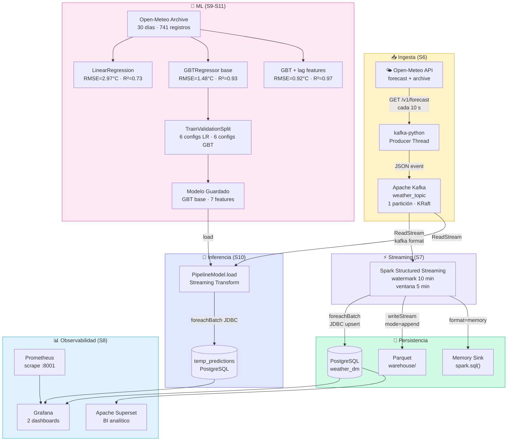
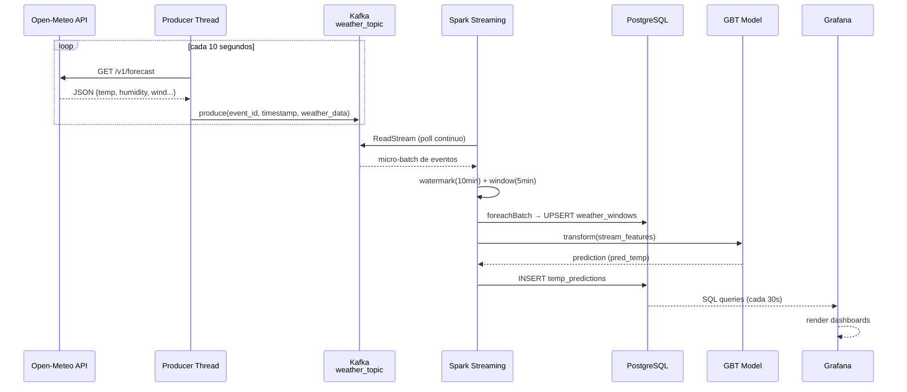
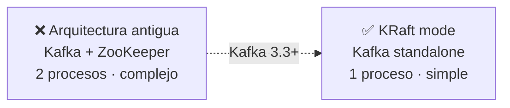
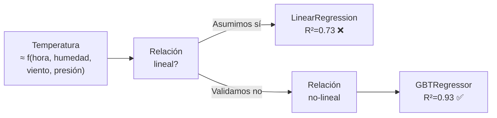
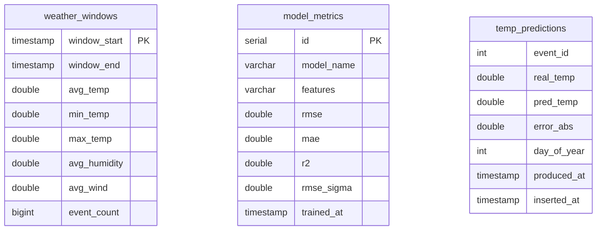

# Arquitectura del Pipeline

Visión completa de los componentes, flujos de datos y decisiones de diseño del pipeline S6–S11.

---

## Diagrama de componentes

---

## Flujo de datos detallado

---

## Decisiones de diseño

### Kafka — KRaft sin ZooKeeper

!!! info "Por qué KRaft"
    Para un pipeline de demo/educativo, ZooKeeper añade complejidad innecesaria.
    KRaft (Kafka Raft) integra el coordinador en el mismo broker desde Kafka 3.3.

---

### Spark — Watermark + Ventana tumbling

!!! note "Parámetros de ventana"
    | Parámetro | Valor | Razonamiento |
    |-----------|-------|--------------|
    | Watermark | 10 min | Tolerancia a eventos tardíos de la API |
    | Ventana | 5 min | Granularidad suficiente para temperatura |
    | Trigger | processingTime=10s | Balance latencia/throughput |
    | Output mode | update | Solo emite ventanas modificadas |

---

### ML — Por qué GBT sobre Linear Regression

!!! tip "Lag features"
    La temperatura actual depende fuertemente de la temperatura de las últimas horas.
    Añadir `temp_lag1/2/3` (lags de 1-3 horas) mejora R² de 0.93 → 0.97, pero requiere
    estado temporal — incompatible con streaming stateless. Por eso el modelo de producción
    usa solo las 7 features sin lags.

---

## Puertos de acceso

| Servicio | URL | Credenciales |
|----------|-----|-------------|
| Jupyter (Spark) | `http://localhost:8888` | token en logs |
| Grafana | `http://localhost:3000` | admin / admin |
| Apache Superset | `http://localhost:8088` | admin / admin |
| Spark UI | `http://localhost:4040` | — |
| Prometheus | `http://localhost:9090` | — |

---

## Tablas PostgreSQL

