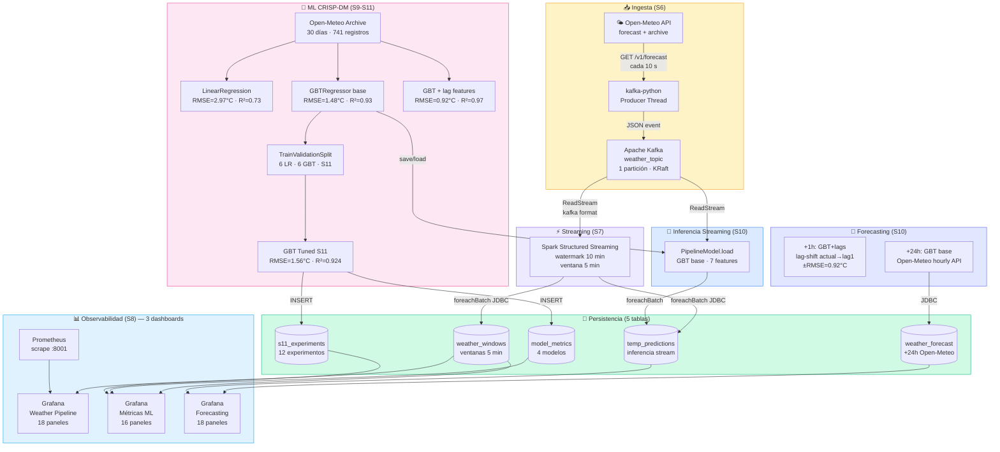
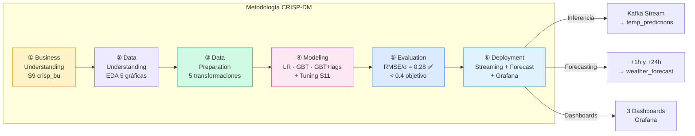
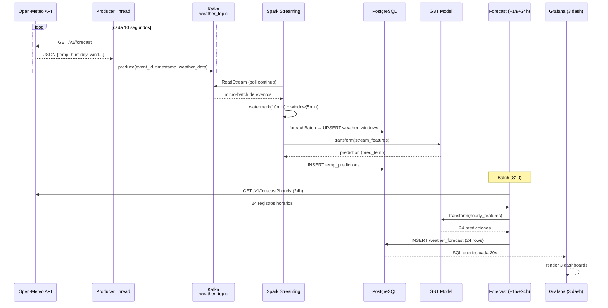
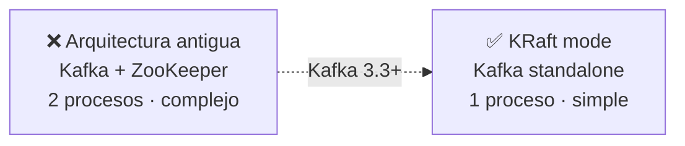
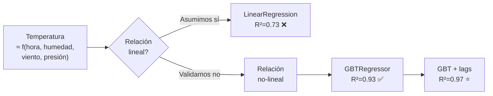
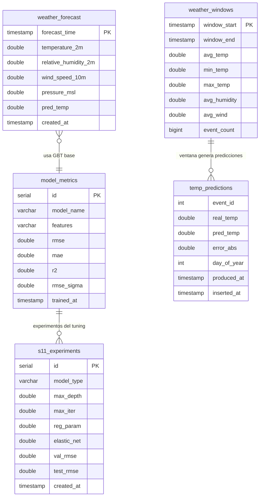

# Arquitectura del Pipeline

Visión completa de los componentes, flujos de datos y decisiones de diseño del pipeline S6–S11,
incluyendo CRISP-DM, forecasting y observabilidad con 3 dashboards.

---

## Diagrama de componentes

---

## Flujo CRISP-DM

---

## Flujo de datos detallado

---

## Decisiones de diseño

### Kafka — KRaft sin ZooKeeper

!!! info "Por qué KRaft"
    Para un pipeline de demo/educativo, ZooKeeper añade complejidad innecesaria.
    KRaft integra el coordinador en el mismo broker desde Kafka 3.3.

---

### ML — Por qué GBT sobre Linear Regression

!!! tip "Lag features vs. Streaming"
    Los lags (temp última hora) mejoran R² de 0.93 → 0.97, pero requieren estado temporal —
    incompatible con streaming stateless. El modelo de producción usa 7 features base.
    El modelo con lags se usa solo en batch (forecasting +1h).

---

### Forecasting — Dos horizontes

!!! note "Estrategias de forecasting"
    | Horizonte | Estrategia | Precisión |
    |-----------|-----------|-----------|
    | **+1 hora** | GBT+lags · lag-shift (actual→lag1) | ±0.92°C (RMSE del modelo) |
    | **+24 horas** | GBT base · Open-Meteo hourly API como features | MAE vs. referencia API |

    El forecast +24h no predice desde cero — usa la predicción de la API meteorológica como
    *feature de entrada* al modelo GBT, añadiendo la corrección aprendida del histórico.

---

## Puertos de acceso

| Servicio | URL | Credenciales |
|----------|-----|-------------|
| Jupyter (Spark) | `http://localhost:8888` | token en logs |
| Grafana | `http://localhost:3000` | admin / admin |
| Spark UI | `http://localhost:4040` | — |
| Prometheus | `http://localhost:9090` | — |

---

## Tablas PostgreSQL

