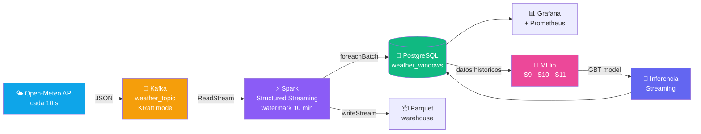
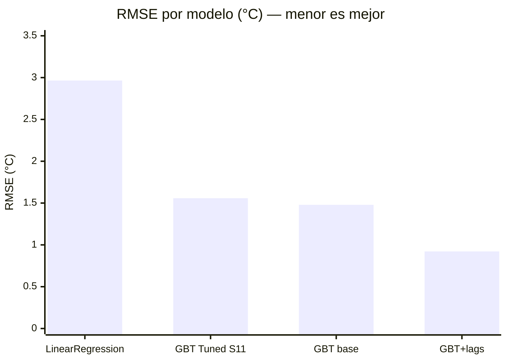

# Big Data Pipeline — Unidad 2

Pipeline de ingesta, procesamiento en streaming y ML distribuido sobre datos meteorológicos reales.

---

## Flujo general

---

## Sesiones cubiertas

| # | Sesión | Tecnología | Resultado |
|---|--------|-----------|-----------|
| S6 | Kafka — tópico, productor, consumidor | KRaft · kafka-python | Contrato de evento JSON validado |
| S7 | Structured Streaming — ventanas, watermark | Spark 3.5 | Latencia p95 < 200 ms |
| S8 | Observabilidad — métricas, alertas, costos | Prometheus · Grafana | 2 dashboards operativos |
| S9 | ML distribuido — regresión con MLlib | VectorAssembler · GBT | R² = 0.974 con lag features |
| S10 | Series de tiempo + inferencia streaming | PipelineModel.load | MAE stream ≈ 0.33°C |
| S11 | Tuning distribuido — TrainValidationSplit | ParamGridBuilder | 12 experimentos, GBT campeón |

---

## Resultados de modelos

| Modelo | Features | RMSE | MAE | R² | RMSE/σ |
|--------|----------|-----:|----:|---:|-------:|
| LinearRegression | base (7) | 2.965°C | 2.435°C | 0.726 | 0.538 |
| GBT Tuned (S11) | base (7) | 1.558°C | — | 0.924 | 0.283 |
| GBTRegressor base | base (7) | 1.479°C | 1.029°C | 0.932 | 0.269 |
| **GBT + lag features** | lag (10) | **0.922°C** | **0.587°C** | **0.974** | **0.167** |

!!! success "Modelo campeón de producción"
    **GBT base** (7 features, sin lags) se usa en **streaming** — compatible con datos en tiempo real sin estado.
    **GBT + lags** es el mejor modelo batch con RMSE/σ = 0.17 (37.7% mejor que GBT base).

---

## Stack tecnológico

=== "Ingesta"
    - **Apache Kafka 7.5** — KRaft mode, sin ZooKeeper
    - **Open-Meteo API** — datos meteorológicos gratuitos cada 10 s
    - **kafka-python** — producer daemon thread

=== "Procesamiento"
    - **Apache Spark 3.5** Structured Streaming
    - Watermark 10 min + ventanas tumbling 5 min
    - Sinks: PostgreSQL · Parquet · Memory

=== "Machine Learning"
    - **MLlib** — LinearRegression, GBTRegressor, Pipeline
    - **TrainValidationSplit** — grid search distribuido
    - Features: cyclic hour encoding, day_of_year, lag features

=== "Observabilidad"
    - **Prometheus** — scrape métricas Spark cada 15 s
    - **Grafana** — dashboard infra + dashboard ML results
    - **Apache Superset** — BI analítico sobre PostgreSQL

=== "Infraestructura"
    - Docker Compose — 5 servicios (Kafka, Spark, PG, Grafana, Superset)
    - Jupyter PySpark notebook integrado
    - GitHub Actions → MkDocs → GitHub Pages
