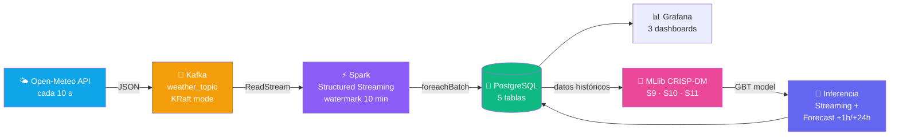
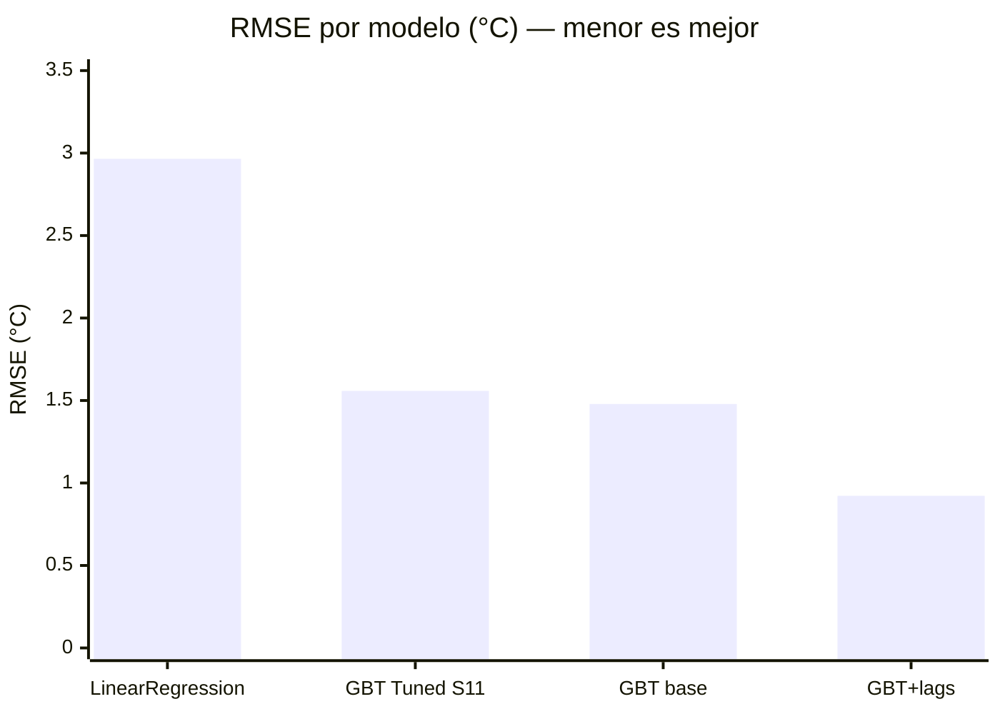

# Big Data Pipeline — Unidad 2

Pipeline de ingesta, procesamiento en streaming, ML distribuido y forecasting meteorológico.
Metodología **CRISP-DM** aplicada end-to-end sobre datos reales de Open-Meteo.

---

## Flujo general

---

## Sesiones cubiertas

| # | Sesión | Tecnología | Resultado |
|---|--------|-----------|-----------|
| S6 | Kafka — tópico, productor, consumidor | KRaft · kafka-python | Contrato de evento JSON validado |
| S7 | Structured Streaming — ventanas, watermark | Spark 3.5 | Latencia p95 < 200 ms |
| S8 | Observabilidad — métricas, alertas | Prometheus · Grafana | 3 dashboards operativos |
| S9 | ML distribuido — CRISP-DM con MLlib | VectorAssembler · GBT · EDA | R² = 0.974 con lag features |
| S10 | Series de tiempo, inferencia y forecasting | PipelineModel · Open-Meteo hourly | +1h ±0.92°C · +24h vía API |
| S11 | Tuning distribuido — TrainValidationSplit | ParamGridBuilder · PostgreSQL | 12 experimentos, GBT campeón RMSE=1.56°C |

---

## Resultados de modelos

| Modelo | Features | RMSE | MAE | R² | RMSE/σ |
|--------|----------|-----:|----:|---:|-------:|
| LinearRegression | base (7) | 2.965°C | 2.435°C | 0.726 | 0.538 |
| GBT Tuned (S11) | base (7) | 1.558°C | — | 0.924 | 0.283 |
| GBTRegressor base | base (7) | 1.479°C | 1.029°C | 0.932 | 0.269 |
| **GBT + lag features** | lag (10) | **0.922°C** | **0.587°C** | **0.974** | **0.167** |

!!! success "Criterio de éxito CRISP-DM: RMSE/σ < 0.4"
    **GBT Tuned S11**: RMSE/σ = 0.283 ✅ — cumple el criterio de negocio.
    **GBT base**: RMSE/σ = 0.269 ✅ — modelo de producción en streaming.
    **GBT + lags**: RMSE/σ = 0.167 ✅ — mejor modelo batch (forecasting +1h).

---

## Forecasting

!!! tip "Predicción de temperatura"
    | Horizonte | Método | Precisión esperada |
    |-----------|--------|-------------------|
    | **+1 hora** | GBT+lags · lag-shift (temp actual → lag1) | ±0.92°C |
    | **+24 horas** | GBT base · Open-Meteo /v1/forecast hourly | referencia API + corrección modelo |

    Los resultados se persisten en `weather_forecast` y se visualizan en el dashboard **Forecasting** de Grafana.

---

## Stack tecnológico

=== "Ingesta"
    - **Apache Kafka 7.5** — KRaft mode, sin ZooKeeper
    - **Open-Meteo API** — datos meteorológicos gratuitos cada 10 s
    - **kafka-python** — producer daemon thread

=== "Procesamiento"
    - **Apache Spark 3.5** Structured Streaming
    - Watermark 10 min + ventanas tumbling 5 min
    - Sinks: PostgreSQL (5 tablas) · Memory

=== "Machine Learning"
    - **CRISP-DM** — metodología completa (6 fases) en S9–S11
    - **MLlib** — LinearRegression, GBTRegressor, Pipeline
    - **TrainValidationSplit** — grid search distribuido (12 experimentos)
    - Features: cyclic hour encoding, day_of_year, lag features
    - **Forecasting** — +1h lag-shift · +24h Open-Meteo hourly API

=== "Observabilidad"
    - **Prometheus** — scrape métricas Spark cada 15 s
    - **Grafana** — 3 dashboards: Weather Pipeline · Métricas ML · Forecasting
    - PostgreSQL como datasource SQL (grafana-postgresql-datasource)

=== "Infraestructura"
    - Docker Compose — 6 servicios (Kafka, Spark, PG, Prometheus, Grafana, Jupyter)
    - GitHub Actions → MkDocs Material → GitHub Pages
