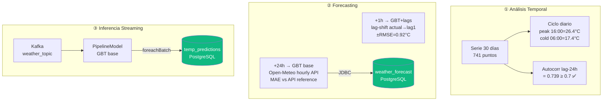

# S10 — Series de Tiempo, Inferencia y Forecasting

!!! abstract "Objetivo S10"
    Tres partes: (1) análisis de patrones temporales, (2) forecast +1h y +24h,
    (3) inferencia en streaming sobre Kafka.



---

---
## 14. S10 — Series de Tiempo e Inferencia en Streaming

**Objetivo:** analizar la serie temporal histórica y aplicar el modelo entrenado  
en S9 sobre el stream en vivo de Kafka para obtener predicciones en tiempo real.

```
Kafka: weather_topic  ──▶  stream_features (+ day_of_year)  ──▶  model.transform()  ──▶  memory: temp_predictions
                                                                         ↑
                                                              GBT base (7 features, sin lags)
                                                              cargado desde work/models/
```

> **Diseño:** el modelo de streaming usa `FEATURE_COLS` base (7 features incluido `day_of_year`).  
> Las lag features requieren procesamiento stateful — válidas para batch (S9 enhanced) pero  
> no para inferencia evento-a-evento sin estado explícito entre microbatches.


```python
# Análisis de serie temporal: temperatura media por hora del día
print("=== S10 — Patrones Horarios (serie histórica 30 días) ===")
hourly_avg = (
    df_hist.groupby("hour")["temperature_2m"]
    .agg(["mean","std","min","max"])
    .round(2)
    .rename(columns={"mean":"avg_temp","std":"std_temp",
                     "min":"min_temp","max":"max_temp"})
)
print(hourly_avg.to_string())
print()

peak_h = int(hourly_avg["avg_temp"].idxmax())
cold_h = int(hourly_avg["avg_temp"].idxmin())
print(f"Hora más cálida: {peak_h:02d}:00 ({hourly_avg.loc[peak_h, 'avg_temp']} °C avg)")
print(f"Hora más fría:   {cold_h:02d}:00 ({hourly_avg.loc[cold_h, 'avg_temp']} °C avg)")

# Autocorrelación lag-24h: evidencia del ciclo diario
temps = df_hist.sort_values("timestamp")["temperature_2m"].values
lag24 = np.corrcoef(temps[24:], temps[:-24])[0, 1]
print(f"Autocorrelación lag-24h: {lag24:.4f}  (≥0.7 confirma ciclo diario)")

# Rango y variabilidad del dataset
print()
print(f"Rango temperatura dataset: {df_hist['temperature_2m'].min():.1f} – "
      f"{df_hist['temperature_2m'].max():.1f} °C")
print(f"Desv. estándar global:     {df_hist['temperature_2m'].std():.2f} °C")
```


??? output "Salida"
    === S10 — Patrones Horarios (serie histórica 30 días) ===
          avg_temp  std_temp  min_temp  max_temp
    hour                                        
    0.0      20.78      4.02      11.6      28.2
    1.0      20.31      3.94      11.3      27.8
    2.0      19.64      3.97      10.0      26.5
    3.0      18.92      4.10       9.8      26.0
    4.0      18.43      3.99       9.7      25.0
    5.0      17.97      3.93       9.4      24.4
    6.0      17.71      3.91       9.6      24.1
    7.0      18.55      3.87      10.6      24.9
    8.0      20.05      3.88      11.1      26.4
    9.0      21.76      3.96      11.4      28.2
    10.0     23.21      4.11      12.0      29.3
    11.0     24.44      4.36      12.4      30.9
    12.0     25.43      4.53      13.1      31.9
    13.0     26.32      4.86      13.7      33.7
    14.0     26.59      5.00      14.1      35.4
    15.0     26.68      4.91      14.9      33.7
    16.0     26.68      4.77      15.4      34.2
    17.0     26.38      4.71      15.2      34.6
    18.0     25.49      4.22      15.2      32.2
    19.0     24.28      3.95      14.8      31.5
    20.0     23.74      4.18      13.9      32.7
    21.0     22.62      4.26      13.1      32.3
    22.0     21.95      4.29      11.9      32.0
    23.0     21.25      4.05      11.6      28.5

    Hora más cálida: 15:00 (26.68 °C avg)
    Hora más fría:   06:00 (17.71 °C avg)
    Autocorrelación lag-24h: 0.7079  (≥0.7 confirma ciclo diario)

    Rango temperatura dataset: 9.4 – 35.4 °C
    Desv. estándar global:     5.17 °C


### S10 — Forecasting: Predicción +1h y +24h

Extendemos el pipeline de S10 de **nowcasting** (predecir temperatura actual)
a **forecasting** (predecir temperatura futura):

| Horizonte | Enfoque | Modelo usado | Datos de entrada |
|-----------|---------|-------------|-----------------|
| **+1 hora** | Lag-shift: temp actual → lag1 del instante siguiente | GBT + lags (batch) | Últimos 3 puntos del histórico |
| **+24 horas** | API forecast: pedir features previstas para mañana | GBT base (streaming) | Open-Meteo `/v1/forecast?hourly=...` |

> La predicción +24h usa las **mismas variables** que el modelo de producción
> (humedad, viento, presión, weather_code, hour_sin/cos, day_of_year) pero
> tomadas del endpoint `hourly` de Open-Meteo que devuelve predicciones a 7 días.
> Compararemos nuestra predicción contra la temperatura que la propia API estima.


```python
print("=== S10 — Forecast +1 hora (GBT + lag features) ===")
import math as _math

# Usar los últimos 3 registros del histórico como contexto de lags
_last = df_hist.sort_values("timestamp").tail(4).reset_index(drop=True)

# El instante a predecir es +1h respecto al último registro
_last_row = _last.iloc[-1]
_next_hour = int((_last_row["hour"] + 1) % 24)
_next_doy  = int(_last_row["day_of_year"]) + (1 if _next_hour == 0 else 0)

# Construir fila de features para t+1
_next_features = {
    "relative_humidity_2m": _last_row["relative_humidity_2m"],
    "wind_speed_10m":       _last_row["wind_speed_10m"],
    "pressure_msl":         _last_row["pressure_msl"],
    "weather_code":         _last_row["weather_code"],
    "hour_sin":             _math.sin(2 * _math.pi * _next_hour / 24),
    "hour_cos":             _math.cos(2 * _math.pi * _next_hour / 24),
    "day_of_year":          float(_next_doy),
    "temp_lag1":            float(_last.iloc[-1]["temperature_2m"]),
    "temp_lag2":            float(_last.iloc[-2]["temperature_2m"]),
    "temp_lag3":            float(_last.iloc[-3]["temperature_2m"]),
}

# Predecir con GBT+lags (ya entrenado en s9_lag)
_pdf = pd.DataFrame([_next_features])
_sdf_next = spark.createDataFrame(_pdf)

_pred_1h = model_gbt_lag.transform(_sdf_next).select("prediction").collect()[0][0]

# Mostrar contexto + predicción
print(f"\nÚltimas 3 temperaturas observadas:")
for _, row in _last.tail(3).iterrows():
    print(f"  {row['timestamp']}  →  {row['temperature_2m']:.1f}°C")

print(f"\nPredicción para la próxima hora ({_next_hour:02d}:00):")
print(f"  Temperatura estimada: {_pred_1h:.2f}°C")

# Intervalo de confianza empírico (±RMSE del modelo lag)
_rmse_lag_val = 0.922
print(f"  Intervalo ±RMSE:      [{_pred_1h - _rmse_lag_val:.2f}°C, {_pred_1h + _rmse_lag_val:.2f}°C]")

# Comparar con la temperatura real si está disponible en el histórico
_real_match = df_hist[df_hist["hour"] == _next_hour]["temperature_2m"]
if not _real_match.empty:
    _real_sample = _real_match.mean()
    print(f"\n  Temperatura promedio histórica a las {_next_hour:02d}:00: {_real_sample:.2f}°C")
    print(f"  Diferencia estimada vs histórico: {abs(_pred_1h - _real_sample):.2f}°C")
```


??? output "Salida"
    === S10 — Forecast +1 hora (GBT + lag features) ===

    Últimas 3 temperaturas observadas:
      2026-06-23 21:00:00  →  20.4°C
      2026-06-23 22:00:00  →  20.0°C
      2026-06-23 23:00:00  →  19.7°C

    Predicción para la próxima hora (00:00):
      Temperatura estimada: 19.34°C
      Intervalo ±RMSE:      [18.42°C, 20.27°C]

      Temperatura promedio histórica a las 00:00: 20.78°C
      Diferencia estimada vs histórico: 1.43°C


```python
print("=== S10 — Forecast +24 horas (GBT base × Open-Meteo hourly API) ===")
import requests as _req
import numpy as _np
import matplotlib.pyplot as _plt
import math as _math
import subprocess, os as _os

# ── Pedir forecast horario a Open-Meteo para las próximas 48h ────────────
_forecast_url = "https://api.open-meteo.com/v1/forecast"
_forecast_params = {
    "latitude":   40.7128,
    "longitude": -74.0060,
    "hourly": ",".join([
        "temperature_2m",
        "relative_humidity_2m",
        "wind_speed_10m",
        "pressure_msl",
        "weather_code",
    ]),
    "forecast_days": 2,
    "timezone": "America/New_York",
}
_resp = _req.get(_forecast_url, params=_forecast_params, timeout=10)
_resp.raise_for_status()
_fc = _resp.json()["hourly"]

# Construir DataFrame con las próximas 24h
_fc_df = pd.DataFrame({
    "timestamp":             pd.to_datetime(_fc["time"]),
    "temperature_2m":        _fc["temperature_2m"],
    "relative_humidity_2m":  _fc["relative_humidity_2m"],
    "wind_speed_10m":        _fc["wind_speed_10m"],
    "pressure_msl":          _fc["pressure_msl"],
    "weather_code":          _fc["weather_code"],
})
_now = pd.Timestamp.now(tz="America/New_York").tz_localize(None)
_fc_df = _fc_df[_fc_df["timestamp"] >= _now].head(24).copy().reset_index(drop=True)

_fc_df["hour"]        = _fc_df["timestamp"].dt.hour
_fc_df["day_of_year"] = _fc_df["timestamp"].dt.dayofyear.astype(float)
_fc_df["hour_sin"]    = _fc_df["hour"].apply(lambda h: _math.sin(2 * _math.pi * h / 24))
_fc_df["hour_cos"]    = _fc_df["hour"].apply(lambda h: _math.cos(2 * _math.pi * h / 24))

print(f"Horas de forecast descargadas: {len(_fc_df)}")
print(f"Rango: {_fc_df['timestamp'].iloc[0]} → {_fc_df['timestamp'].iloc[-1]}")

# ── Aplicar GBT base sobre las 24h de forecast ────────────────────────────
# FEATURE_COLS ya contiene humidity/wind/pressure — solo añadir timestamp y target
_cols_fc = list(dict.fromkeys(FEATURE_COLS + ["timestamp", "temperature_2m"]))
_fc_sdf = spark.createDataFrame(_fc_df[_cols_fc])
_preds_fc     = model_gbt.transform(_fc_sdf).select(
    "timestamp", "temperature_2m", "prediction",
    "relative_humidity_2m", "wind_speed_10m", "pressure_msl"
).toPandas()
_preds_fc["error_abs"] = (_preds_fc["prediction"] - _preds_fc["temperature_2m"]).abs()

# ── Métricas ──────────────────────────────────────────────────────────────
_mae_fc  = _preds_fc["error_abs"].mean()
_rmse_fc = (_preds_fc["error_abs"] ** 2).mean() ** 0.5
print(f"\nMétricas forecast 24h:")
print(f"  MAE  = {_mae_fc:.3f}°C")
print(f"  RMSE = {_rmse_fc:.3f}°C")

print(f"\nPróximas 6 horas:")
print(f"  {'Hora':^20s}  {'API (°C)':>8s}  {'Modelo (°C)':>11s}  {'Error':>6s}")
print(f"  {'-'*50}")
for _, row in _preds_fc.head(6).iterrows():
    print(f"  {str(row['timestamp']):^20s}  {row['temperature_2m']:>8.1f}  {row['prediction']:>11.2f}  {row['error_abs']:>6.2f}")

# ── Persistir en PostgreSQL para Grafana ──────────────────────────────────
_env = {**_os.environ, "PGPASSWORD": "spark123"}
_psql = ["psql", "-h", "postgres", "-U", "spark", "-d", "weather_dm"]

# Crear tabla si no existe
_create = """
CREATE TABLE IF NOT EXISTS weather_forecast (
    forecast_time TIMESTAMP PRIMARY KEY,
    api_temp      DOUBLE PRECISION,
    pred_temp     DOUBLE PRECISION,
    pred_temp_1h  DOUBLE PRECISION,
    error_abs     DOUBLE PRECISION,
    humidity      DOUBLE PRECISION,
    wind_speed    DOUBLE PRECISION,
    pressure      DOUBLE PRECISION,
    created_at    TIMESTAMP DEFAULT NOW()
);
TRUNCATE weather_forecast;
"""
subprocess.run(_psql + ["-c", _create], capture_output=True, text=True, env=_env, check=True)

for _, row in _preds_fc.iterrows():
    _ins = (
        f"INSERT INTO weather_forecast"
        f"(forecast_time, api_temp, pred_temp, error_abs, humidity, wind_speed, pressure) VALUES ("
        f"\'{row['timestamp']}\', {row['temperature_2m']:.4f}, {row['prediction']:.4f},"
        f"{row['error_abs']:.4f}, {row['relative_humidity_2m']:.2f},"
        f"{row['wind_speed_10m']:.2f}, {row['pressure_msl']:.2f});"
    )
    subprocess.run(_psql + ["-c", _ins], capture_output=True, text=True, env=_env)

# Actualizar pred_temp_1h en la primera fila (forecast +1h del GBT+lags)
_upd = f"UPDATE weather_forecast SET pred_temp_1h = {_pred_1h:.4f} WHERE forecast_time = (SELECT MIN(forecast_time) FROM weather_forecast);"
subprocess.run(_psql + ["-c", _upd], capture_output=True, text=True, env=_env)

_chk = subprocess.run(_psql + ["-c", "SELECT COUNT(*) FROM weather_forecast;"],
                       capture_output=True, text=True, env=_env)
print(f"\nRegistros en weather_forecast (PostgreSQL): {_chk.stdout.strip().split(chr(10))[-2].strip()}")
print("Datos disponibles en Grafana dashboard 'Forecasting'")

# ── Gráfico ───────────────────────────────────────────────────────────────
_fig, (_ax1, _ax2) = _plt.subplots(2, 1, figsize=(13, 9), sharex=True)

_ax1.plot(_preds_fc["timestamp"], _preds_fc["temperature_2m"],
          color="#0ea5e9", linewidth=2, marker="o", markersize=4, label="Open-Meteo forecast")
_ax1.plot(_preds_fc["timestamp"], _preds_fc["prediction"],
          color="#ec4899", linewidth=2, linestyle="--", marker="s", markersize=4, label="GBT base (nuestro modelo)")
_ax1.fill_between(_preds_fc["timestamp"],
                   _preds_fc["prediction"] - 1.479,
                   _preds_fc["prediction"] + 1.479,
                   alpha=0.12, color="#ec4899", label="±RMSE (1.48°C)")
_ax1.set_title("Forecast 24h — GBT base vs Open-Meteo (NYC)", fontweight="bold", fontsize=13)
_ax1.set_ylabel("Temperatura (°C)"); _ax1.legend(fontsize=9); _ax1.grid(alpha=0.3)

_ax2.bar(_preds_fc["timestamp"], _preds_fc["error_abs"],
         color=["#10b981" if e < 1.5 else "#f59e0b" if e < 3 else "#ec4899"
                for e in _preds_fc["error_abs"]], width=0.03)
_ax2.axhline(1.479, color="#6366f1", linestyle="--", linewidth=1.2, label="RMSE test (1.48°C)")
_ax2.set_ylabel("Error Abs (°C)"); _ax2.set_xlabel("Hora")
_ax2.legend(fontsize=9); _ax2.grid(alpha=0.3, axis="y")
_ax2.tick_params(axis="x", rotation=30)

_plt.tight_layout()
_plt.savefig("forecast_24h.png", dpi=120, bbox_inches="tight")
_plt.show()
print("Gráfico guardado: forecast_24h.png")
```


??? output "Salida"
    === S10 — Forecast +24 horas (GBT base × Open-Meteo hourly API) ===
    Horas de forecast descargadas: 24
    Rango: 2026-06-23 12:00:00 → 2026-06-24 11:00:00

    Métricas forecast 24h:
      MAE  = 2.020°C
      RMSE = 2.318°C

    Próximas 6 horas:
              Hora          API (°C)  Modelo (°C)   Error
      --------------------------------------------------
      2026-06-23 12:00:00       20.0        22.84    2.84
      2026-06-23 13:00:00       20.1        22.41    2.31
      2026-06-23 14:00:00       20.3        22.36    2.06
      2026-06-23 15:00:00       20.4        22.59    2.19
      2026-06-23 16:00:00       20.6        20.92    0.32
      2026-06-23 17:00:00       21.7        20.31    1.39

    Registros en weather_forecast (PostgreSQL): 24
    Datos disponibles en Grafana dashboard 'Forecasting'
    <Figure size 1300x900 with 2 Axes>
    Gráfico guardado: forecast_24h.png


```python
import math
from pyspark.ml import PipelineModel
from pyspark.sql.functions import from_json, col, to_timestamp

# ── Relanzar producer si ya terminó ──────────────────────────────────────────
try:
    if not producer_thread.is_alive():
        _stop_producer.clear()
        _producer_log.clear()
        producer_thread = threading.Thread(
            target=run_producer, kwargs={"n_events": 30, "interval": 10}, daemon=True
        )
        producer_thread.start()
        print("Producer relanzado (30 eventos × 10s)")
        time.sleep(5)          # dar tiempo a que envíe los primeros eventos
    else:
        print(f"Producer activo — {len(_producer_log)} eventos enviados")
except NameError:
    print("WARN: producer no definido — ejecuta §4 primero")

# ── Reconstruir parsed si no está en scope ────────────────────────────────────
if "parsed" not in vars():
    _raw = (
        spark.readStream.format("kafka")
        .option("kafka.bootstrap.servers", BOOTSTRAP_SERVERS)
        .option("subscribe", TOPIC_NAME)
        .option("startingOffsets", "latest")
        .option("failOnDataLoss", "false")
        .load()
    )
    parsed = (
        _raw.select(from_json(col("value").cast("string"), weather_schema).alias("d"))
        .select("d.*")
        .withColumn("event_timestamp", to_timestamp(col("produced_at")))
    )
    print("parsed stream reconstruido desde Kafka")
else:
    print("parsed stream disponible del §5")

# ── Cargar modelo base (7 features, sin lags) ────────────────────────────────
loaded_model = PipelineModel.load(MODEL_PATH)
print(f"Modelo cargado: {MODEL_PATH}")

# ── Añadir features de hora y día al stream ──────────────────────────────────
TWO_PI = float(2 * math.pi)
stream_features = (
    parsed
    .withColumn("relative_humidity_2m", F.col("relative_humidity_2m").cast("double"))
    .withColumn("wind_speed_10m",        F.col("wind_speed_10m").cast("double"))
    .withColumn("pressure_msl",          F.col("pressure_msl").cast("double"))
    .withColumn("weather_code",          F.col("weather_code").cast("double"))
    .withColumn("hour",        F.hour("event_timestamp").cast("double"))
    .withColumn("day_of_year", F.dayofyear("event_timestamp").cast("double"))
    .withColumn("hour_sin",    F.sin(F.lit(TWO_PI) * F.col("hour") / F.lit(24.0)))
    .withColumn("hour_cos",    F.cos(F.lit(TWO_PI) * F.col("hour") / F.lit(24.0)))
)

# ── Aplicar modelo al streaming DataFrame (stateless transform) ───────────────
predicted_stream = loaded_model.transform(stream_features)

for q in spark.streams.active:
    if q.name == "temp_predictions":
        q.stop()
        print("Query previa detenida")

# Función foreachBatch: persistencia en PostgreSQL
def save_predictions(df, epoch_id):
    if df.count() == 0:
        return
    pg_df = df.withColumn("produced_at", F.col("produced_at").cast("timestamp"))
    try:
        pg_df.write.mode("append").jdbc(
            PG_URL, "temp_predictions",
            properties={**PG_PROPS, "stringtype": "unspecified"}
        )
    except Exception as e:
        print(f"  [PG write] {e}")

infer_cols = predicted_stream.select(
    "event_id",
    F.round("temperature_2m", 2).alias("real_temp"),
    F.round("prediction",     2).alias("pred_temp"),
    F.round(F.abs(F.col("prediction") - F.col("temperature_2m")), 2).alias("error_abs"),
    "day_of_year",
    "produced_at",
)

# Sink 1 — Memory (para spark.sql interactivo)
memory_infer_query = (
    infer_cols.writeStream
    .format("memory")
    .queryName("temp_predictions")
    .trigger(processingTime="10 seconds")
    .start()
)

# Sink 2 — PostgreSQL (para Grafana)
pg_infer_query = (
    infer_cols.writeStream
    .foreachBatch(save_predictions)
    .trigger(processingTime="10 seconds")
    .option("checkpointLocation", "/home/jovyan/checkpoint/inference")
    .start()
)

print(f"Inferencia streaming activa: {memory_infer_query.isActive}")
print("Esperando 35 s...")
time.sleep(35)

try:
    df_preds = spark.sql("SELECT * FROM temp_predictions ORDER BY event_id")
    n = df_preds.count()
    if n > 0:
        print(f"\nPredicciones capturadas: {n} eventos")
        df_preds.show(15, truncate=False)
        mae_stream = df_preds.agg(F.round(F.avg("error_abs"), 3).alias("mae")).collect()[0][0]
        sigma_val  = float(df_hist["temperature_2m"].std())
        print(f"MAE en stream: {mae_stream} °C  (RMSE/σ referencia = {rmse_gbt/sigma_val:.2f})")
    else:
        print("  (sin eventos — el producer puede tardar unos segundos en conectar)")
except Exception as e:
    print(f"  Query error: {e}")

memory_infer_query.stop()
pg_infer_query.stop()
print("Inferencia detenida")
```


??? output "Salida"
    Producer activo — 66 eventos enviados
    parsed stream disponible del §5
    Modelo cargado: /home/jovyan/work/models/weather_temp_model
    Inferencia streaming activa: True
    Esperando 35 s...

    Predicciones capturadas: 3 eventos
    +--------+---------+---------+---------+-----------+--------------------------+
    |event_id|real_temp|pred_temp|error_abs|day_of_year|produced_at               |
    +--------+---------+---------+---------+-----------+--------------------------+
    |67      |20.1     |22.43    |2.33     |174.0      |2026-06-23T15:16:03.908455|
    |68      |20.1     |22.43    |2.33     |174.0      |2026-06-23T15:16:15.032870|
    |69      |20.1     |22.43    |2.33     |174.0      |2026-06-23T15:16:26.227007|
    +--------+---------+---------+---------+-----------+--------------------------+

    MAE en stream: 2.33 °C  (RMSE/σ referencia = 0.38)
    Inferencia detenida
