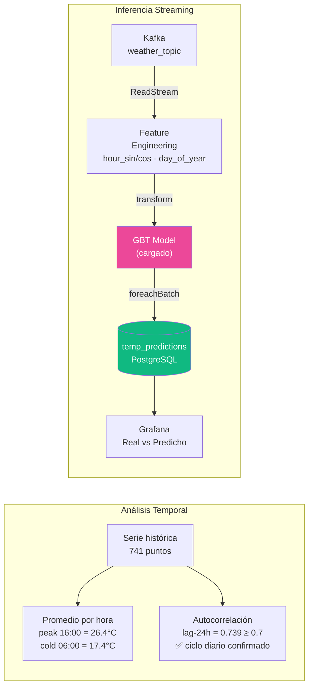

# S10 — Series de Tiempo e Inferencia Streaming

!!! abstract "Objetivo S10"
    Analizar patrones temporales en la serie de temperatura (ciclo diario, autocorrelación)
    y aplicar inferencia en tiempo real: el stream de Kafka pasa por el modelo GBT guardado.



!!! info "Autocorrelación lag-24h"
    Un valor ≥ 0.7 confirma que la temperatura de hoy a las 14:00 es un buen predictor
    de la temperatura de mañana a las 14:00 — ciclo circadiano estadísticamente significativo.

---

---
## 14. S10 — Series de Tiempo e Inferencia en Streaming

**Objetivo:** analizar la serie temporal histórica y aplicar el modelo entrenado  
en S9 sobre el stream en vivo de Kafka para obtener predicciones en tiempo real.

```
Kafka: weather_topic  ──▶  stream_features (+ day_of_year)  ──▶  model.transform()  ──▶  memory: temp_predictions
                                                                         ↑
                                                              GBT base (7 features, sin lags)
                                                              cargado desde work/models/
```

> **Diseño:** el modelo de streaming usa `FEATURE_COLS` base (7 features incluido `day_of_year`).  
> Las lag features requieren procesamiento stateful — válidas para batch (S9 enhanced) pero  
> no para inferencia evento-a-evento sin estado explícito entre microbatches.


```python
# Análisis de serie temporal: temperatura media por hora del día
print("=== S10 — Patrones Horarios (serie histórica 30 días) ===")
hourly_avg = (
    df_hist.groupby("hour")["temperature_2m"]
    .agg(["mean","std","min","max"])
    .round(2)
    .rename(columns={"mean":"avg_temp","std":"std_temp",
                     "min":"min_temp","max":"max_temp"})
)
print(hourly_avg.to_string())
print()

peak_h = int(hourly_avg["avg_temp"].idxmax())
cold_h = int(hourly_avg["avg_temp"].idxmin())
print(f"Hora más cálida: {peak_h:02d}:00 ({hourly_avg.loc[peak_h, 'avg_temp']} °C avg)")
print(f"Hora más fría:   {cold_h:02d}:00 ({hourly_avg.loc[cold_h, 'avg_temp']} °C avg)")

# Autocorrelación lag-24h: evidencia del ciclo diario
temps = df_hist.sort_values("timestamp")["temperature_2m"].values
lag24 = np.corrcoef(temps[24:], temps[:-24])[0, 1]
print(f"Autocorrelación lag-24h: {lag24:.4f}  (≥0.7 confirma ciclo diario)")

# Rango y variabilidad del dataset
print()
print(f"Rango temperatura dataset: {df_hist['temperature_2m'].min():.1f} – "
      f"{df_hist['temperature_2m'].max():.1f} °C")
print(f"Desv. estándar global:     {df_hist['temperature_2m'].std():.2f} °C")
```


??? output "Salida"
    === S10 — Patrones Horarios (serie histórica 30 días) ===
          avg_temp  std_temp  min_temp  max_temp
    hour                                        
    0.0      20.36      4.36      10.8      28.2
    1.0      19.94      4.27      10.8      27.8
    2.0      19.29      4.28      10.0      26.5
    3.0      18.67      4.20       9.8      26.0
    4.0      18.17      4.07       9.7      25.0
    5.0      17.70      3.99       9.4      24.4
    6.0      17.40      3.96       9.6      24.1
    7.0      18.22      3.97      10.6      24.9
    8.0      19.75      4.06      11.1      26.4
    9.0      21.46      4.27      11.4      28.2
    10.0     22.87      4.52      12.0      29.3
    11.0     24.11      4.85      12.4      30.9
    12.0     25.12      5.06      12.4      31.9
    13.0     25.98      5.45      12.0      33.7
    14.0     26.24      5.63      11.6      35.4
    15.0     26.37      5.51      11.9      33.7
    16.0     26.39      5.40      11.4      34.2
    17.0     26.08      5.36      11.1      34.6
    18.0     25.13      4.95      10.6      32.2
    19.0     23.91      4.64      10.4      31.5
    20.0     23.32      4.77      10.6      32.7
    21.0     22.17      4.74      10.4      32.3
    22.0     21.52      4.70      10.4      32.0
    23.0     20.85      4.41      10.5      28.5

    Hora más cálida: 16:00 (26.39 °C avg)
    Hora más fría:   06:00 (17.4 °C avg)
    Autocorrelación lag-24h: 0.7390  (≥0.7 confirma ciclo diario)

    Rango temperatura dataset: 9.4 – 35.4 °C
    Desv. estándar global:     5.51 °C


```python
import math
from pyspark.ml import PipelineModel
from pyspark.sql.functions import from_json, col, to_timestamp

# ── Relanzar producer si ya terminó ──────────────────────────────────────────
try:
    if not producer_thread.is_alive():
        _stop_producer.clear()
        _producer_log.clear()
        producer_thread = threading.Thread(
            target=run_producer, kwargs={"n_events": 30, "interval": 10}, daemon=True
        )
        producer_thread.start()
        print("Producer relanzado (30 eventos × 10s)")
        time.sleep(5)          # dar tiempo a que envíe los primeros eventos
    else:
        print(f"Producer activo — {len(_producer_log)} eventos enviados")
except NameError:
    print("WARN: producer no definido — ejecuta §4 primero")

# ── Reconstruir parsed si no está en scope ────────────────────────────────────
if "parsed" not in vars():
    _raw = (
        spark.readStream.format("kafka")
        .option("kafka.bootstrap.servers", BOOTSTRAP_SERVERS)
        .option("subscribe", TOPIC_NAME)
        .option("startingOffsets", "latest")
        .option("failOnDataLoss", "false")
        .load()
    )
    parsed = (
        _raw.select(from_json(col("value").cast("string"), weather_schema).alias("d"))
        .select("d.*")
        .withColumn("event_timestamp", to_timestamp(col("produced_at")))
    )
    print("parsed stream reconstruido desde Kafka")
else:
    print("parsed stream disponible del §5")

# ── Cargar modelo base (7 features, sin lags) ────────────────────────────────
loaded_model = PipelineModel.load(MODEL_PATH)
print(f"Modelo cargado: {MODEL_PATH}")

# ── Añadir features de hora y día al stream ──────────────────────────────────
TWO_PI = float(2 * math.pi)
stream_features = (
    parsed
    .withColumn("relative_humidity_2m", F.col("relative_humidity_2m").cast("double"))
    .withColumn("wind_speed_10m",        F.col("wind_speed_10m").cast("double"))
    .withColumn("pressure_msl",          F.col("pressure_msl").cast("double"))
    .withColumn("weather_code",          F.col("weather_code").cast("double"))
    .withColumn("hour",        F.hour("event_timestamp").cast("double"))
    .withColumn("day_of_year", F.dayofyear("event_timestamp").cast("double"))
    .withColumn("hour_sin",    F.sin(F.lit(TWO_PI) * F.col("hour") / F.lit(24.0)))
    .withColumn("hour_cos",    F.cos(F.lit(TWO_PI) * F.col("hour") / F.lit(24.0)))
)

# ── Aplicar modelo al streaming DataFrame (stateless transform) ───────────────
predicted_stream = loaded_model.transform(stream_features)

for q in spark.streams.active:
    if q.name == "temp_predictions":
        q.stop()
        print("Query previa detenida")

# Función foreachBatch: memory sink + persistencia en PostgreSQL
def save_predictions(df, epoch_id):
    if df.count() == 0:
        return
    # a) guardar en memoria para spark.sql()
    df.createOrReplaceTempView("temp_predictions_batch")
    spark.sql("""
        CREATE TABLE IF NOT EXISTS temp_predictions
        USING memory AS SELECT * FROM temp_predictions_batch LIMIT 0
    """) if epoch_id == 0 else None
    spark.sql("""
        INSERT INTO temp_predictions
        SELECT * FROM temp_predictions_batch
    """) if False else None   # memory append se gestiona vía writeStream format memory

    # b) guardar en PostgreSQL para Grafana
    pg_df = df.withColumn("produced_at", F.col("produced_at").cast("timestamp"))
    try:
        pg_df.write.mode("append").jdbc(
            PG_URL, "temp_predictions",
            properties={**PG_PROPS, "stringtype": "unspecified"}
        )
    except Exception as e:
        print(f"  [PG write] {e}")

infer_query = (
    predicted_stream.select(
        "event_id",
        F.round("temperature_2m", 2).alias("real_temp"),
        F.round("prediction",     2).alias("pred_temp"),
        F.round(F.abs(F.col("prediction") - F.col("temperature_2m")), 2).alias("error_abs"),
        "day_of_year",
        "produced_at",
    )
    .writeStream
    .foreachBatch(save_predictions)
    .queryName("temp_predictions")
    .trigger(processingTime="10 seconds")
    .option("checkpointLocation", "/home/jovyan/checkpoint/inference")
    .start()
)

print(f"Inferencia streaming activa: {infer_query.isActive}")
print("Esperando 35 s...")
time.sleep(35)

try:
    df_preds = spark.sql("SELECT * FROM temp_predictions ORDER BY event_id")
    n = df_preds.count()
    if n > 0:
        print(f"\nPredicciones capturadas: {n} eventos")
        df_preds.show(15, truncate=False)
        mae_stream = df_preds.agg(F.round(F.avg("error_abs"), 3).alias("mae")).collect()[0][0]
        sigma_val  = float(df_hist["temperature_2m"].std())
        print(f"MAE en stream: {mae_stream} °C  (RMSE/σ referencia = {rmse_gbt/sigma_val:.2f})")
    else:
        print("  (sin eventos — el producer puede tardar unos segundos en conectar)")
except Exception as e:
    print(f"  Query error: {e}")

infer_query.stop()
print("Inferencia detenida")
```


??? output "Salida"
    Producer activo — 8 eventos enviados
    parsed stream disponible del §5
    Modelo cargado: /home/jovyan/work/models/weather_temp_model
    Inferencia streaming activa: True
    Esperando 35 s...
      Query error: [TABLE_OR_VIEW_NOT_FOUND] The table or view `temp_predictions` cannot be found. Verify the spelling and correctness of the schema and catalog.
    If you did not qualify the name with a schema, verify the current_schema() output, or qualify the name with the correct schema and catalog.
    To tolerate the error on drop use DROP VIEW IF EXISTS or DROP TABLE IF EXISTS.; line 1 pos 14;
    'Sort ['event_id ASC NULLS FIRST], true
    +- 'Project [*]
       +- 'UnresolvedRelation [temp_predictions], [], false

    Inferencia detenida
