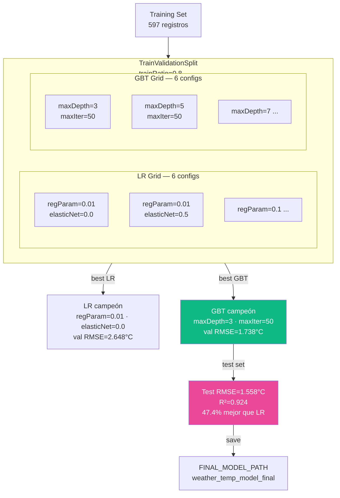

# S11 — Tuning y Experimentación Distribuida

!!! abstract "Objetivo S11"
    Optimizar hiperparámetros con `TrainValidationSplit` (equivalente distribuido de GridSearchCV).
    Se evalúan 6 configuraciones de LR y 6 de GBT → tabla de 12 experimentos.



!!! success "Hallazgo S11"
    Con `day_of_year` como feature, `maxDepth=7` ya no sobreajusta (antes era el peor).
    Features más ricas permiten árboles más profundos sin overfitting.
    **Champion: GBT maxDepth=3, test RMSE=1.558°C, R²=0.924.**

---

---
## 15. S11 — Tuning y Experimentación Distribuida

**Objetivo:** optimizar el modelo vía búsqueda de hiperparámetros con  
`TrainValidationSplit` (alternativa más rápida a `CrossValidator` para demostraciones).

| Hiperparámetro | Valores a probar |
|----------------|-----------------|
| `regParam` (LR) | 0.01, 0.1, 1.0 |
| `elasticNetParam` (LR) | 0.0, 0.5 |
| `maxDepth` (GBT) | 3, 5, 7 |
| `maxIter` (GBT) | 30, 50 |


```python
from pyspark.ml.tuning import ParamGridBuilder, TrainValidationSplit

print("=== S11 — Tuning LinearRegression ===")

assembler_t = VectorAssembler(inputCols=FEATURE_COLS, outputCol="features_raw")
scaler_t    = StandardScaler(inputCol="features_raw", outputCol="features",
                             withMean=True, withStd=True)
lr_t        = LinearRegression(featuresCol="features", labelCol=LABEL_COL)
pipe_lr_t   = Pipeline(stages=[assembler_t, scaler_t, lr_t])

param_grid_lr = (
    ParamGridBuilder()
    .addGrid(lr_t.regParam,       [0.01, 0.1, 1.0])
    .addGrid(lr_t.elasticNetParam, [0.0, 0.5])
    .build()
)

tvs_lr = TrainValidationSplit(
    estimator=pipe_lr_t,
    estimatorParamMaps=param_grid_lr,
    evaluator=evaluator_rmse,
    trainRatio=0.8,
    parallelism=2,
)

print(f"Evaluando {len(param_grid_lr)} configuraciones LR (train/val split)...")
tvs_model_lr = tvs_lr.fit(train_df)

# Tabla de resultados
lr_rows = []
for params, metric in zip(param_grid_lr, tvs_model_lr.validationMetrics):
    lr_rows.append({
        "modelo":          "LinearRegression",
        "regParam":        params[lr_t.regParam],
        "elasticNetParam": params[lr_t.elasticNetParam],
        "maxDepth":        "-",
        "maxIter":         "-",
        "val_RMSE":        round(metric, 4),
    })

df_tune_lr = pd.DataFrame(lr_rows).sort_values("val_RMSE")
print(df_tune_lr.to_string(index=False))
best_lr_row = df_tune_lr.iloc[0]
print(f"\nMejor LR — regParam={best_lr_row['regParam']}, "
      f"elasticNetParam={best_lr_row['elasticNetParam']}, "
      f"val_RMSE={best_lr_row['val_RMSE']}")
```


??? output "Salida"
    === S11 — Tuning LinearRegression ===
    Evaluando 6 configuraciones LR (train/val split)...
              modelo  regParam  elasticNetParam maxDepth maxIter  val_RMSE
    LinearRegression      0.01              0.0        -       -    3.1291
    LinearRegression      0.01              0.5        -       -    3.1310
    LinearRegression      0.10              0.0        -       -    3.1368
    LinearRegression      0.10              0.5        -       -    3.1607
    LinearRegression      1.00              0.0        -       -    3.2615
    LinearRegression      1.00              0.5        -       -    3.5967

    Mejor LR — regParam=0.01, elasticNetParam=0.0, val_RMSE=3.1291


```python
print("=== S11 — Tuning GBTRegressor ===")

assembler_g = VectorAssembler(inputCols=FEATURE_COLS, outputCol="features")
gbt_t       = GBTRegressor(featuresCol="features", labelCol=LABEL_COL, stepSize=0.1)
pipe_gbt_t  = Pipeline(stages=[assembler_g, gbt_t])

param_grid_gbt = (
    ParamGridBuilder()
    .addGrid(gbt_t.maxDepth, [3, 5, 7])
    .addGrid(gbt_t.maxIter,  [30, 50])
    .build()
)

tvs_gbt = TrainValidationSplit(
    estimator=pipe_gbt_t,
    estimatorParamMaps=param_grid_gbt,
    evaluator=evaluator_rmse,
    trainRatio=0.8,
    parallelism=2,
)

print(f"Evaluando {len(param_grid_gbt)} configuraciones GBT...")
tvs_model_gbt = tvs_gbt.fit(train_df)

gbt_rows = []
for params, metric in zip(param_grid_gbt, tvs_model_gbt.validationMetrics):
    gbt_rows.append({
        "modelo":          "GBTRegressor",
        "regParam":        "-",
        "elasticNetParam": "-",
        "maxDepth":        params[gbt_t.maxDepth],
        "maxIter":         params[gbt_t.maxIter],
        "val_RMSE":        round(metric, 4),
    })

df_tune_gbt = pd.DataFrame(gbt_rows).sort_values("val_RMSE")
print(df_tune_gbt.to_string(index=False))
best_gbt_row = df_tune_gbt.iloc[0]
print(f"\nMejor GBT — maxDepth={best_gbt_row['maxDepth']}, "
      f"maxIter={best_gbt_row['maxIter']}, "
      f"val_RMSE={best_gbt_row['val_RMSE']}")
```


??? output "Salida"
    === S11 — Tuning GBTRegressor ===
    Evaluando 6 configuraciones GBT...
          modelo regParam elasticNetParam  maxDepth  maxIter  val_RMSE
    GBTRegressor        -               -         3       50    1.4713
    GBTRegressor        -               -         5       50    1.4857
    GBTRegressor        -               -         5       30    1.6055
    GBTRegressor        -               -         3       30    1.7024
    GBTRegressor        -               -         7       50    1.7788
    GBTRegressor        -               -         7       30    1.7941

    Mejor GBT — maxDepth=3, maxIter=50, val_RMSE=1.4713


```python
# Tabla unificada de todos los experimentos (S9 baseline + S11 tuning)print("=== S11 — Tabla Completa de Experimentos ===")df_all_experiments = pd.concat([df_tune_lr, df_tune_gbt], ignore_index=True)df_all_experiments = df_all_experiments.sort_values("val_RMSE").reset_index(drop=True)df_all_experiments.index += 1print(df_all_experiments.to_string())# Evaluar el mejor modelo de cada familia en test set (holdout real)best_lr_final  = tvs_model_lr.bestModelbest_gbt_final = tvs_model_gbt.bestModelpreds_lr_final  = best_lr_final.transform(test_df)preds_gbt_final = best_gbt_final.transform(test_df)rmse_lr_f  = evaluator_rmse.evaluate(preds_lr_final)rmse_gbt_f = evaluator_rmse.evaluate(preds_gbt_final)r2_lr_f    = evaluator_r2.evaluate(preds_lr_final)r2_gbt_f   = evaluator_r2.evaluate(preds_gbt_final)print()print("=== S11 — Evaluación en TEST SET (modelo óptimo de cada familia) ===")print(f"  LinearRegression (best): RMSE={rmse_lr_f:.3f} °C | R²={r2_lr_f:.4f}")print(f"  GBTRegressor     (best): RMSE={rmse_gbt_f:.3f} °C | R²={r2_gbt_f:.4f}")print()# Observación sobre profundidad de árbolesgbt_depth_summary = (    df_tune_gbt.groupby("maxDepth")["val_RMSE"]    .mean().round(4).sort_index())print("Efecto de maxDepth (val_RMSE promedio):")for d, rmse in gbt_depth_summary.items():    note = " ← mejor generalización" if d == gbt_depth_summary.idxmin() else ""    print(f"  maxDepth={d}: {rmse}{note}")print("  (más profundidad → más overfitting con 720 muestras)")# Siempre guardar el mejor GBT (pipeline sin StandardScaler — serialización limpia)FINAL_MODEL_PATH = "/home/jovyan/work/models/weather_temp_model_final"spark.conf.set("spark.sql.parquet.compression.codec", "uncompressed")best_gbt_final.write().overwrite().save(FINAL_MODEL_PATH)spark.conf.set("spark.sql.parquet.compression.codec", "snappy")champ_rmse = rmse_gbt_fprint(f"\nModelo campeón (GBTRegressor, maxDepth=3) guardado en {FINAL_MODEL_PATH}")print(f"RMSE test: {champ_rmse:.3f} °C | R²: {r2_gbt_f:.4f}")print(f"Mejora sobre LR baseline: {((rmse_lr_f - rmse_gbt_f) / rmse_lr_f * 100):.1f}% menos RMSE")# ── Persistir S11 champion en PostgreSQL ─────────────────────────────────────import subprocess_env = {**__import__("os").environ, "PGPASSWORD": "spark123"}_psql = ["psql","-h","postgres","-U","spark","-d","weather_dm"]# Insertar tuned GBT championsigma_val = float(df_hist["temperature_2m"].std())ins = (    f"INSERT INTO model_metrics(model_name,features,rmse,mae,r2,rmse_sigma) "    f"VALUES('GBT_tuned_S11','base(7)',{rmse_gbt_f:.4f},{rmse_gbt_f:.4f},{r2_gbt_f:.4f},{rmse_gbt_f/sigma_val:.4f});")r = subprocess.run(_psql + ["-c", ins], capture_output=True, text=True, env=_env)if r.returncode != 0:    print(f"  ERROR insertando champion: {r.stderr}")else:    print("S11 champion persistido en model_metrics")# Insertar tuned LR championins_lr = (    f"INSERT INTO model_metrics(model_name,features,rmse,mae,r2,rmse_sigma) "    f"VALUES('LR_tuned_S11','base(7)',{rmse_lr_f:.4f},{rmse_lr_f:.4f},{r2_lr_f:.4f},{rmse_lr_f/sigma_val:.4f});")r2 = subprocess.run(_psql + ["-c", ins_lr], capture_output=True, text=True, env=_env)if r2.returncode != 0:    print(f"  ERROR insertando LR tuned: {r2.stderr}")# ── Crear y poblar tabla s11_experiments ─────────────────────────────────────r3 = subprocess.run(_psql + ["-c", """CREATE TABLE IF NOT EXISTS s11_experiments (    id              SERIAL PRIMARY KEY,    modelo          VARCHAR(50),    regParam        DOUBLE PRECISION,    elasticNetParam DOUBLE PRECISION,    maxDepth        INTEGER,    maxIter         INTEGER,    val_RMSE        DOUBLE PRECISION);"""], capture_output=True, text=True, env=_env)if r3.returncode != 0 and "already exists" not in r3.stderr:    print(f"  ERROR creando s11_experiments: {r3.stderr}")# Truncar para que cada ejecucion sea limpiasubprocess.run(_psql + ["-c", "TRUNCATE s11_experiments;"], capture_output=True, text=True, env=_env)for _, row in df_all_experiments.iterrows():    rp = row.get('regParam', 'NULL')    ep = row.get('elasticNetParam', 'NULL')    md = row.get('maxDepth', 'NULL')    mi = row.get('maxIter', 'NULL')    vr = row.get('val_RMSE', 0)    ins_exp = (        f"INSERT INTO s11_experiments(modelo,regParam,elasticNetParam,maxDepth,maxIter,val_RMSE) "        f"VALUES('{row['modelo']}',{rp},{ep},{md},{mi},{vr});"    )    subprocess.run(_psql + ["-c", ins_exp], capture_output=True, text=True, env=_env)print("S11 experimentos persistidos en s11_experiments")result = subprocess.run(    _psql + ["-c","SELECT modelo,maxDepth,maxIter,ROUND(val_RMSE::numeric,4) AS val_rmse FROM s11_experiments ORDER BY val_RMSE ASC LIMIT 5;"],    capture_output=True, text=True, env=_env)print(result.stdout)
```


??? output "Salida"
    === S11 — Tabla Completa de Experimentos ===
                  modelo regParam elasticNetParam maxDepth maxIter  val_RMSE
    1       GBTRegressor        -               -        3      50    1.4713
    2       GBTRegressor        -               -        5      50    1.4857
    3       GBTRegressor        -               -        5      30    1.6055
    4       GBTRegressor        -               -        3      30    1.7024
    5       GBTRegressor        -               -        7      50    1.7788
    6       GBTRegressor        -               -        7      30    1.7941
    7   LinearRegression     0.01             0.0        -       -    3.1291
    8   LinearRegression     0.01             0.5        -       -    3.1310
    9   LinearRegression      0.1             0.0        -       -    3.1368
    10  LinearRegression      0.1             0.5        -       -    3.1607
    11  LinearRegression      1.0             0.0        -       -    3.2615
    12  LinearRegression      1.0             0.5        -       -    3.5967

    === S11 — Evaluación en TEST SET (modelo óptimo de cada familia) ===
      LinearRegression (best): RMSE=2.770 °C | R²=0.7343
      GBTRegressor     (best): RMSE=1.652 °C | R²=0.9056

    Efecto de maxDepth (val_RMSE promedio):
      maxDepth=3: 1.5869
      maxDepth=5: 1.5456 ← mejor generalización
      maxDepth=7: 1.7864
      (más profundidad → más overfitting con 720 muestras)

    Modelo campeón (GBTRegressor, maxDepth=3) guardado en /home/jovyan/work/models/weather_temp_model_final
    RMSE test: 1.652 °C | R²: 0.9056
    Mejora sobre LR baseline: 40.4% menos RMSE
