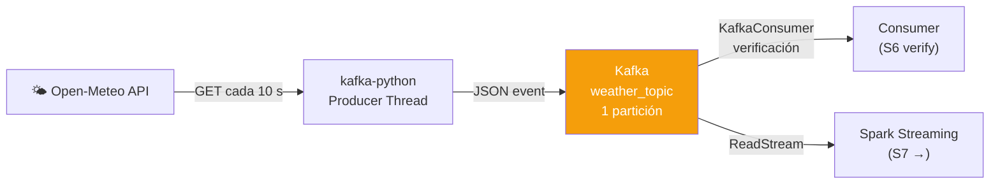

# S6 — Apache Kafka

!!! abstract "Objetivo S6"
    Implementar un pipeline Kafka completo: tópico, contrato de evento, producer en background
    y consumer de verificación. Se usa **KRaft mode** (sin ZooKeeper) con un solo broker.



---

## 2. Kafka — Topic y Contrato de Evento (S6)


### 2.1 Contrato de Evento — `weather_topic`

**Tipo:** Lectura de condiciones meteorológicas actuales (NYC) via Open-Meteo  
**Serialización:** JSON UTF-8  
**Particionado:** 1 partición  |  **Clave:** `nyc-{event_id}` (todos a P0)  
**Producción:** polling cada 10 s  |  Resolución temporal API: 900 s (15 min)

| Campo | Tipo JSON | Tipo Spark | Ejemplo | Descripción |
|-------|-----------|------------|---------|-------------|
| `time` | string | StringType | `"2026-05-19T12:00"` | Timestamp del dato API (15-min resolution) |
| `temperature_2m` | float | DoubleType | `32.1` | Temperatura a 2 m (°C) |
| `relative_humidity_2m` | int | IntegerType | `52` | Humedad relativa (%) |
| `wind_speed_10m` | float | DoubleType | `17.1` | Viento a 10 m (km/h) |
| `pressure_msl` | float | DoubleType | `1016.6` | Presión al nivel del mar (hPa) |
| `weather_code` | int | IntegerType | `0` | Código WMO (0=despejado, 95=tormenta) |
| `event_id` | int | IntegerType | `7` | Contador secuencial del producer |
| `produced_at` | string | StringType | `"2026-05-19T12:01:05.123"` | Timestamp real del producer → **event_timestamp** |

> **Nota de diseño:** `time` tiene resolución 15 min (intervalo API).  
> Se usa `produced_at` como `event_timestamp` en Spark para que el watermark avance  
> con cada evento (cada 10 s) y las ventanas sean demostrables en tiempo real.

**Estrategia de escalado:** para múltiples ciudades usar `city_code` como partition key  
→ distribución uniforme y paralelismo por ciudad (1 partición por ciudad recomendado).


```python
admin = KafkaAdminClient(bootstrap_servers=BOOTSTRAP_SERVERS, client_id="pipeline-admin")
try:
    admin.create_topics([NewTopic(name=TOPIC_NAME, num_partitions=1, replication_factor=1)])
    print(f"Topic '{TOPIC_NAME}' creado")
except TopicAlreadyExistsError:
    print(f"Topic '{TOPIC_NAME}' ya existe")

topics = admin.list_topics()
print(f"Topics disponibles: {topics}")
admin.close()

# Ejemplo de mensaje que producirá el producer
example_event = {
    "time": "2026-05-19T12:00",
    "temperature_2m": 32.1,
    "relative_humidity_2m": 52,
    "wind_speed_10m": 17.1,
    "pressure_msl": 1016.6,
    "weather_code": 0,
    "event_id": 7,
    "produced_at": "2026-05-19T12:01:05.123456"
}
print()
print("=== Ejemplo de mensaje (contrato de evento) ===")
print(f"  topic:     {TOPIC_NAME}")
print(f"  partition: 0")
print(f"  key:       nyc-7")
print(f"  value:     {json.dumps(example_event, indent=10)}")
```


??? output "Salida"
    Topic 'weather_topic' creado
    Topics disponibles: ['weather_topic']

    === Ejemplo de mensaje (contrato de evento) ===
      topic:     weather_topic
      partition: 0
      key:       nyc-7
      value:     {
              "time": "2026-05-19T12:00",
              "temperature_2m": 32.1,
              "relative_humidity_2m": 52,
              "wind_speed_10m": 17.1,
              "pressure_msl": 1016.6,
              "weather_code": 0,
              "event_id": 7,
              "produced_at": "2026-05-19T12:01:05.123456"
    }


```python
# Re-ejecutar para ver el log del producer en cualquier momento
print(f"Producer vivo: {producer_thread.is_alive()} | Eventos enviados: {len(_producer_log)}")
for line in _producer_log[-8:]:
    print(" ", line)
```


??? output "Salida"
    Producer vivo: True | Eventos enviados: 1
      [#  1] offset=  83 | temp=20.1°C | wind=5.1 km/h | at=2026-06-22T04:01:34


## 5. Spark Structured Streaming — ReadStream desde Kafka (S6 + S7)


```python
weather_schema = StructType([
    StructField("time",                 StringType(),  True),
    StructField("temperature_2m",       DoubleType(),  True),
    StructField("relative_humidity_2m", IntegerType(), True),
    StructField("wind_speed_10m",       DoubleType(),  True),
    StructField("pressure_msl",         DoubleType(),  True),
    StructField("weather_code",         IntegerType(), True),
    StructField("event_id",             IntegerType(), True),
    StructField("produced_at",          StringType(),  True),
])

raw_stream = (
    spark.readStream
    .format("kafka")
    .option("kafka.bootstrap.servers", BOOTSTRAP_SERVERS)
    .option("subscribe", TOPIC_NAME)
    .option("startingOffsets", "latest")   # solo eventos nuevos desde que arranca el stream
    .option("failOnDataLoss", "false")
    .load()
)

# Usar produced_at como event_timestamp → avanza cada 10s (no cada 15min como 'time')
parsed = (
    raw_stream
    .select(from_json(col("value").cast("string"), weather_schema).alias("d"))
    .select("d.*")
    .withColumn("event_timestamp", to_timestamp(col("produced_at")))
)

print("=== Parsed stream schema ===")
parsed.printSchema()
```


??? output "Salida"
    === Parsed stream schema ===
    root
     |-- time: string (nullable = true)
     |-- temperature_2m: double (nullable = true)
     |-- relative_humidity_2m: integer (nullable = true)
     |-- wind_speed_10m: double (nullable = true)
     |-- pressure_msl: double (nullable = true)
     |-- weather_code: integer (nullable = true)
     |-- event_id: integer (nullable = true)
     |-- produced_at: string (nullable = true)
     |-- event_timestamp: timestamp (nullable = true)


## 6. Watermark + Ventanas de Tiempo (S7)

| Param | Valor | Razonamiento |
|-------|-------|-------------|
| `event_timestamp` | `produced_at` | Avanza cada 10 s → ventanas se llenan en minutos |
| watermark | 10 min | Tolera eventos tardíos hasta 10 min después del watermark |
| window | 5 min tumbling | Agrupa eventos de cada 5 minutos |
| trigger | 5 s | Procesa cada 5 s (micro-batch por defecto de Spark) |
| output mode | update | Solo emite ventanas que cambiaron en el batch |
| sink | memory | Resultados consultables con `spark.sql()` sin bloquear |


## 8. S6 — Verificación del Consumer (últimos mensajes)

Usa un KafkaConsumer puro para leer los últimos 5 mensajes del topic  
y mostrar el mensaje completo tal como llegó al broker.


```python
print(f"=== S6 — Consumer: leyendo ultimos 5 mensajes de '{TOPIC_NAME}' ===")
print()

tp = TopicPartition(TOPIC_NAME, 0)
consumer = KafkaConsumer(
    bootstrap_servers=BOOTSTRAP_SERVERS,
    value_deserializer=lambda m: json.loads(m.decode("utf-8")),
    key_deserializer=lambda k: k.decode("utf-8") if k else None,
    auto_offset_reset="latest",
    enable_auto_commit=False,
)
consumer.assign([tp])
consumer.poll(timeout_ms=1000)   # trigger partition assignment

end_offset   = consumer.end_offsets([tp])[tp]
start_offset = max(0, end_offset - 5)
consumer.seek(tp, start_offset)

messages = []
while True:
    records = consumer.poll(timeout_ms=3000)
    if not records:
        break
    for _, msgs in records.items():
        for msg in msgs:
            messages.append(msg)
    if messages and messages[-1].offset >= end_offset - 1:
        break

consumer.close()

if messages:
    print(f"Leidos {len(messages)} mensajes (offsets {start_offset}-{end_offset-1})")
    print()
    for msg in messages:
        print(f"  partition={msg.partition} | offset={msg.offset} | key={msg.key}")
        print(f"  value = {json.dumps(msg.value, indent=4)}")
        print()
else:
    print("Sin mensajes en el topic — ejecutar primero el producer (§4)")
```


??? output "Salida"
    === S6 — Consumer: leyendo ultimos 5 mensajes de 'weather_topic' ===
    /tmp/ipykernel_79416/365598387.py:5: DeprecationWarning: key_deserializer does not implement kafka.serializer.Deserializer
      consumer = KafkaConsumer(
    /tmp/ipykernel_79416/365598387.py:5: DeprecationWarning: value_deserializer does not implement kafka.serializer.Deserializer
      consumer = KafkaConsumer(
    Leidos 5 mensajes (offsets 83-87)

      partition=0 | offset=83 | key=nyc-1
      value = {
        "time": "2026-06-22T00:00",
        "temperature_2m": 20.1,
        "relative_humidity_2m": 79,
        "wind_speed_10m": 5.1,
        "pressure_msl": 1014.4,
        "weather_code": 3,
        "event_id": 1,
        "produced_at": "2026-06-22T04:01:34.772754"
    }

      partition=0 | offset=84 | key=nyc-2
      value = {
        "time": "2026-06-22T00:00",
        "temperature_2m": 20.1,
        "relative_humidity_2m": 79,
        "wind_speed_10m": 5.1,
        "pressure_msl": 1014.4,
        "weather_code": 3,
        "event_id": 2,
        "produced_at": "2026-06-22T04:01:45.669004"
    }

      partition=0 | offset=85 | key=nyc-3
      value = {
        "time": "2026-06-22T00:00",
        "temperature_2m": 20.1,
    ... (31 líneas omitidas)
