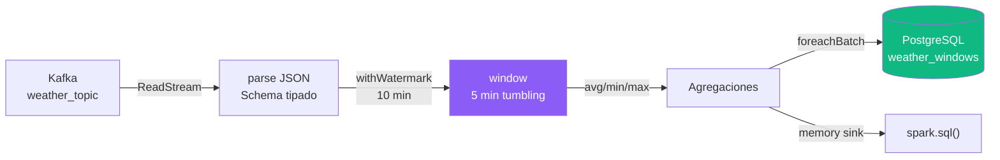

# S7 — Structured Streaming

!!! abstract "Objetivo S7"
    Procesar el stream de Kafka con Spark Structured Streaming aplicando watermark
    y ventanas de tiempo. Comparar triggers y medir latencia/throughput.



!!! info "Parámetros clave"
    | Parámetro | Valor | Motivo |
    |-----------|-------|--------|
    | Watermark | 10 min | Tolera retrasos de la API externa |
    | Ventana | 5 min | Granularidad adecuada para temperatura |
    | Trigger | 10 s | Latencia baja sin overhead excesivo |
    | Output mode | `update` | Solo emite ventanas modificadas |

---

## 7. Monitoreo en vivo

Polling de la tabla `weather_windows` cada 15 s durante ~2 min.  
Muestra el log del producer y las ventanas procesadas en el mismo output.


```python
N_SNAPSHOTS   = 3
POLL_INTERVAL = 10

print(f"=== Monitoreando {N_SNAPSHOTS} snapshots (cada {POLL_INTERVAL}s) ===")
print()

for i in range(N_SNAPSHOTS):
    time.sleep(POLL_INTERVAL)
    t = (i + 1) * POLL_INTERVAL

    n_sent   = len(_producer_log)
    last_evt = _producer_log[-1] if _producer_log else "(sin eventos aun)"
    status   = memory_query.status.get("message", "?")
    prog     = memory_query.lastProgress or {}
    latency  = (prog.get("durationMs") or {}).get("triggerExecution", "?")
    tput     = round(prog.get("processedRowsPerSecond") or 0, 3)

    print(f"--- Snapshot #{i+1} (t={t}s) ---")
    print(f"  producer : {n_sent} eventos | ultimo: {last_evt}")
    print(f"  stream   : {status}")
    print(f"  latencia : {latency} ms  |  throughput: {tput} rps")

    try:
        result = spark.sql(
            "SELECT window.start, window.end, events, avg_temp, avg_humidity, avg_wind "
            "FROM weather_windows ORDER BY window.start DESC"
        )
        n_win = result.count()
        if n_win > 0:
            result.show(truncate=False)
        else:
            print("  (sin ventanas aun — esperando primer batch con datos)")
    except Exception as e:
        print(f"  Query error: {e}")
    print()

print("Monitoreo completado")
```


??? output "Salida"
    === Monitoreando 3 snapshots (cada 10s) ===

    --- Snapshot #1 (t=10s) ---
      producer : 3 eventos | ultimo: [#  3] offset=  85 | temp=20.1°C | wind=5.1 km/h | at=2026-06-22T04:01:56
      stream   : Waiting for next trigger
      latencia : 299 ms  |  throughput: 0 rps
    +-------------------+-------------------+------+--------+------------+--------+
    |start              |end                |events|avg_temp|avg_humidity|avg_wind|
    +-------------------+-------------------+------+--------+------------+--------+
    |2026-06-22 04:00:00|2026-06-22 04:05:00|1     |20.1    |79.0        |5.1     |
    +-------------------+-------------------+------+--------+------------+--------+


    --- Snapshot #2 (t=20s) ---
      producer : 4 eventos | ultimo: [#  4] offset=  86 | temp=20.1°C | wind=5.1 km/h | at=2026-06-22T04:02:07
      stream   : Waiting for next trigger
      latencia : 164 ms  |  throughput: 0 rps
    +-------------------+-------------------+------+--------+------------+--------+
    |start              |end                |events|avg_temp|avg_humidity|avg_wind|
    +-------------------+-------------------+------+--------+------------+--------+
    |2026-06-22 04:00:00|2026-06-22 04:05:00|1     |20.1    |79.0        |5.1     |
    |2026-06-22 04:00:00|2026-06-22 04:05:00|2     |20.1    |79.0        |5.1     |
    +-------------------+-------------------+------+--------+------------+--------+


    --- Snapshot #3 (t=30s) ---
      producer : 5 eventos | ultimo: [#  5] offset=  87 | temp=20.1°C | wind=5.1 km/h | at=2026-06-22T04:02:18
      stream   : Waiting for next trigger
      latencia : 149 ms  |  throughput: 0 rps
    +-------------------+-------------------+------+--------+------------+--------+
    |start              |end                |events|avg_temp|avg_humidity|avg_wind|
    +-------------------+-------------------+------+--------+------------+--------+
    |2026-06-22 04:00:00|2026-06-22 04:05:00|1     |20.1    |79.0        |5.1     |
    |2026-06-22 04:00:00|2026-06-22 04:05:00|2     |20.1    |79.0        |5.1     |
    |2026-06-22 04:00:00|2026-06-22 04:05:00|3     |20.1    |79.0        |5.1     |
    ... (4 líneas omitidas)


```python
# Detener query previa con el mismo nombre si existe (permite re-ejecutar la celda)
for q in spark.streams.active:
    if q.name == "weather_windows":
        q.stop()
        print(f"Query '{q.name}' previa detenida")

def write_to_postgres(df, epoch_id):
    """foreachBatch: upsert micro-batch en PostgreSQL.
    Escribe a staging temporal y hace INSERT ON CONFLICT DO UPDATE.
    """
    cols = [
        col("window.start").alias("window_start"),
        col("window.end").alias("window_end"),
        "events", "avg_temp", "avg_humidity", "avg_wind",
        "min_temp", "max_temp", "min_pressure", "max_pressure"]
    staging = f"weather_windows_stg_{epoch_id}"
    df.select(*cols).write.mode("overwrite").jdbc(PG_URL, staging, properties=PG_PROPS)
    upsert_sql = f"""
    INSERT INTO weather_windows
      (window_start, window_end, events, avg_temp, avg_humidity,
       avg_wind, min_temp, max_temp, min_pressure, max_pressure)
    SELECT window_start, window_end, events, avg_temp, avg_humidity,
           avg_wind, min_temp, max_temp, min_pressure, max_pressure
    FROM {staging}
    ON CONFLICT (window_start, window_end)
    DO UPDATE SET
        events      = EXCLUDED.events,
        avg_temp    = EXCLUDED.avg_temp,
        avg_humidity= EXCLUDED.avg_humidity,
        avg_wind    = EXCLUDED.avg_wind,
        min_temp    = EXCLUDED.min_temp,
        max_temp    = EXCLUDED.max_temp,
        min_pressure= EXCLUDED.min_pressure,
        max_pressure= EXCLUDED.max_pressure;
    DROP TABLE IF EXISTS {staging};
    """
    subprocess.run(
        ["psql", "-h", "postgres", "-U", "spark", "-d", "weather_dm",
         "-c", upsert_sql],
        env={"PGPASSWORD": "spark123"},
        capture_output=True, text=True, check=True
    )

windowed = (
    parsed
    .withWatermark("event_timestamp", "10 minutes")
    .groupBy(window(col("event_timestamp"), "5 minutes"))
    .agg(
        count("*").alias("events"),
        spark_round(avg("temperature_2m"),       2).alias("avg_temp"),
        spark_round(avg("relative_humidity_2m"), 2).alias("avg_humidity"),
        spark_round(avg("wind_speed_10m"),        2).alias("avg_wind"),
        spark_round(spark_min("temperature_2m"),   2).alias("min_temp"),
        spark_round(spark_max("temperature_2m"),   2).alias("max_temp"),
        spark_round(spark_min("pressure_msl"),     2).alias("min_pressure"),
        spark_round(spark_max("pressure_msl"),     2).alias("max_pressure"),
    )
)

# Sink 1 — Memory (para consultas SQL interactivas en el notebook)
memory_query = (
    windowed.writeStream
    .format("memory")
    .queryName("weather_windows")
    .outputMode("update")
    .trigger(processingTime="5 seconds")
    .start()
)

# Sink 2 — PostgreSQL (para persistencia y consumo por BI)
pg_query = (
    windowed.writeStream
    .foreachBatch(write_to_postgres)
    .outputMode("update")
    .trigger(processingTime="5 seconds")
    .option("checkpointLocation", "/home/jovyan/checkpoint/postgres")
    .start()
)

print(f"Memory query activa:  {memory_query.isActive}")
print(f"PostgreSQL query activa: {pg_query.isActive}")

# Sink 3 — Parquet (warehouse para ML)
parquet_query = (
    windowed.writeStream
    .format("parquet")
    .option("path", "/home/jovyan/warehouse/weather_windows")
    .option("checkpointLocation", "/home/jovyan/checkpoint/parquet")
    .outputMode("append")
    .trigger(processingTime="5 seconds")
    .start()
)

print(f"Parquet query activa:  {parquet_query.isActive}")
print(f"Spark UI ->            http://localhost:4040")
```


??? output "Salida"
    Memory query activa:  True
    PostgreSQL query activa: True
    Parquet query activa:  True
    Spark UI ->            http://localhost:4040


### 6.1 Prometheus Metrics Exporter

Exporta métricas del streaming en `http://spark-notebook:8001/metrics` para que
Prometheus las recolecte cada 15s y Grafana las visualice.

| Métrica | Label | Descripción |
|---------|-------|-------------|
| `spark_throughput_rps` | — | Filas procesadas por segundo |
| `spark_trigger_latency_ms` | — | Latencia de ejecución del trigger |
| `spark_state_rows` | — | Filas activas en estado de ventanas |
| `spark_input_rows` | — | Filas de entrada por batch |
| `spark_watermark_lag_s` | — | Atraso del watermark respecto al tiempo real |


```python
_stop_metrics = threading.Event()

# Definir métricas Prometheus
prom_throughput = Gauge("spark_throughput_rps", "Rows processed per second")
prom_latency    = Gauge("spark_trigger_latency_ms", "Trigger execution latency")
prom_state      = Gauge("spark_state_rows", "Active state rows")
prom_input      = Gauge("spark_input_rows", "Input rows per batch")
prom_watermark  = Gauge("spark_watermark_lag_s", "Watermark lag in seconds")

def run_metrics_exporter():
    start_http_server(8001)
    print("Prometheus exporter en http://0.0.0.0:8001/metrics")
    while not _stop_metrics.is_set():
        try:
            prog = memory_query.lastProgress or {}
            if prog:
                dur = prog.get("durationMs") or {}
                prom_throughput.set(prog.get("processedRowsPerSecond", 0))
                prom_latency.set(dur.get("triggerExecution", 0))
                prom_input.set(prog.get("numInputRows", 0))
                so = (prog.get("stateOperators") or [{}])[0]
                prom_state.set(so.get("numRowsTotal", 0))
                wt = (prog.get("eventTime") or {}).get("watermark", "")
                if wt:
                    lag = (datetime.now() - datetime.fromisoformat(wt)).total_seconds()
                    prom_watermark.set(max(lag, 0))
        except Exception:
            pass
        time.sleep(15)

metrics_thread = threading.Thread(target=run_metrics_exporter, daemon=True)
metrics_thread.start()
print("Metrics exporter iniciado — Prometheus scrape target: :8001")
```


??? output "Salida"
    Metrics exporter iniciado — Prometheus scrape target: :8001
    Prometheus exporter en http://0.0.0.0:8001/metrics


```python
# Snapshot manual — re-ejecutar cuando quieras
result = spark.sql(
    "SELECT window.start, window.end, events, avg_temp, avg_humidity, avg_wind, "
    "min_temp, max_temp, min_pressure, max_pressure "
    "FROM weather_windows ORDER BY window.start DESC"
)
print(f"Ventanas en memoria: {result.count()}")
result.show(truncate=False)
```


??? output "Salida"
    Ventanas en memoria: 11
    +-------------------+-------------------+------+--------+------------+--------+--------+--------+------------+------------+
    |start              |end                |events|avg_temp|avg_humidity|avg_wind|min_temp|max_temp|min_pressure|max_pressure|
    +-------------------+-------------------+------+--------+------------+--------+--------+--------+------------+------------+
    |2026-05-19 17:20:00|2026-05-19 17:25:00|7     |34.4    |43.0        |15.8    |34.4    |34.4    |1016.2      |1016.2      |
    |2026-05-19 17:20:00|2026-05-19 17:25:00|9     |34.4    |43.0        |15.8    |34.4    |34.4    |1016.2      |1016.2      |
    |2026-05-19 17:20:00|2026-05-19 17:25:00|10    |34.4    |43.0        |15.8    |34.4    |34.4    |1016.2      |1016.2      |
    |2026-05-19 17:20:00|2026-05-19 17:25:00|2     |34.4    |43.0        |15.8    |34.4    |34.4    |1016.2      |1016.2      |
    |2026-05-19 17:20:00|2026-05-19 17:25:00|5     |34.4    |43.0        |15.8    |34.4    |34.4    |1016.2      |1016.2      |
    |2026-05-19 17:20:00|2026-05-19 17:25:00|8     |34.4    |43.0        |15.8    |34.4    |34.4    |1016.2      |1016.2      |
    |2026-05-19 17:20:00|2026-05-19 17:25:00|11    |34.4    |43.0        |15.8    |34.4    |34.4    |1016.2      |1016.2      |
    |2026-05-19 17:20:00|2026-05-19 17:25:00|1     |34.4    |43.0        |15.8    |34.4    |34.4    |1016.2      |1016.2      |
    |2026-05-19 17:20:00|2026-05-19 17:25:00|6     |34.4    |43.0        |15.8    |34.4    |34.4    |1016.2      |1016.2      |
    |2026-05-19 17:20:00|2026-05-19 17:25:00|3     |34.4    |43.0        |15.8    |34.4    |34.4    |1016.2      |1016.2      |
    |2026-05-19 17:20:00|2026-05-19 17:25:00|4     |34.4    |43.0        |15.8    |34.4    |34.4    |1016.2      |1016.2      |
    +-------------------+-------------------+------+--------+------------+--------+--------+--------+------------+------------+


## 9. S7 — Benchmarking: Trigger vs Watermark

Se ejecutan **3 experimentos** de 60 s cada uno con distintas configuraciones.  
Cada experimento inicia su propia query (mismo readStream, distinto writeStream)  
y captura `recentProgress` para medir latencia y throughput.

| Exp | Trigger | Watermark | Qué muestra |
|-----|---------|-----------|-------------|
| E1 | 5 s | 10 min | Baseline — micro-batch frecuente |
| E2 | 30 s | 10 min | Trigger espaciado — menos overhead, mayor latencia |
| E3 | 5 s | 2 min | Watermark corto — estado más pequeño, ventanas cierran antes |


```python
def run_experiment(name, trigger, watermark, duration=60):
    """Corre un writeStream con los params dados y devuelve metricas agregadas."""
    query_name = f"exp_{name}"
    print(f"\n[{name}] trigger={trigger!r} | watermark={watermark!r} | duration={duration}s")

    # Detener query previa con el mismo nombre si existe
    for q in spark.streams.active:
        if q.name == query_name:
            q.stop()

    exp_windowed = (
        parsed
        .withWatermark("event_timestamp", watermark)
        .groupBy(window(col("event_timestamp"), "5 minutes"))
        .agg(
            count("*").alias("events"),
            spark_round(avg("temperature_2m"), 2).alias("avg_temp"),
        )
    )

    q = (
        exp_windowed.writeStream
        .format("memory")
        .queryName(query_name)
        .outputMode("update")
        .trigger(processingTime=trigger)
        .start()
    )

    time.sleep(duration)
    progress = list(q.recentProgress)
    q.stop()

    all_b  = progress
    data_b = [p for p in progress if p.get("numInputRows", 0) > 0]

    def safe_avg(lst, key, sub=None):
        if not lst:
            return 0.0
        if sub:
            vals = [(p.get(key) or {}).get(sub, 0) for p in lst]
        else:
            vals = [p.get(key) or 0 for p in lst]
        return round(sum(vals) / len(lst), 2)

    avg_state = round(
        sum((p.get("stateOperators") or [{}])[0].get("numRowsTotal", 0) for p in all_b)
        / max(len(all_b), 1),
        1
    )

    summary = {
        "experiment":         name,
        "trigger":            trigger,
        "watermark":          watermark,
        "total_batches":      len(all_b),
        "batches_con_datos":  len(data_b),
        "total_input_rows":   sum(p.get("numInputRows", 0) for p in all_b),
        "avg_latency_ms":     safe_avg(all_b, "durationMs", "triggerExecution"),
        "avg_throughput_rps": safe_avg(data_b, "processedRowsPerSecond"),
        "avg_state_rows":     avg_state,
    }

    print(f"  -> {summary['total_batches']} batches | "
          f"{summary['total_input_rows']} rows | "
          f"avg_latency={summary['avg_latency_ms']} ms | "
          f"throughput={summary['avg_throughput_rps']} rps | "
          f"state_rows={summary['avg_state_rows']}")

    return summary, progress

print("run_experiment() definido")
```


??? output "Salida"
    run_experiment() definido


```python
# Detener queries activas antes de los experimentos
for q in spark.streams.active:
    q.stop()
print("Queries Spark detenidas antes de experimentos")

# Asegurar que el producer sigue activo
if not producer_thread.is_alive():
    _stop_producer.clear()
    _producer_log.clear()
    producer_thread = threading.Thread(
        target=run_producer, kwargs={"n_events": 80, "interval": 10}, daemon=True
    )
    producer_thread.start()
    print("Producer reiniciado")
    time.sleep(5)

exp_results = []
exp_raw     = {}

# Cada experimento dura 60s -> total ~3 minutos
s1, p1 = run_experiment("E1_baseline",  trigger="5 seconds",  watermark="10 minutes", duration=60)
exp_results.append(s1); exp_raw["E1"] = p1

s2, p2 = run_experiment("E2_trigger30", trigger="30 seconds", watermark="10 minutes", duration=60)
exp_results.append(s2); exp_raw["E2"] = p2

s3, p3 = run_experiment("E3_wm2min",   trigger="5 seconds",  watermark="2 minutes",  duration=60)
exp_results.append(s3); exp_raw["E3"] = p3

print("\nExperimentos completados")
```


??? output "Salida"
    Queries Spark detenidas antes de experimentos

    [E1_baseline] trigger='5 seconds' | watermark='10 minutes' | duration=60s
      -> 10 batches | 4 rows | avg_latency=383.7 ms | throughput=1.36 rps | state_rows=0.9

    [E2_trigger30] trigger='30 seconds' | watermark='10 minutes' | duration=60s
      -> 2 batches | 0 rows | avg_latency=108.5 ms | throughput=0.0 rps | state_rows=0.0

    [E3_wm2min] trigger='5 seconds' | watermark='2 minutes' | duration=60s
      -> 5 batches | 0 rows | avg_latency=76.6 ms | throughput=0.0 rps | state_rows=0.0

    Experimentos completados


```python
df_exp = pd.DataFrame(exp_results).set_index("experiment")

print("=== S7 — Tabla Comparativa: Trigger vs Watermark ===")
print()
print(df_exp.to_string())
print()

# Interpretación automática
e1, e2, e3 = [df_exp.loc[k] for k in ["E1_baseline","E2_trigger30","E3_wm2min"]]

print("Observaciones:")
if e2["avg_latency_ms"] > e1["avg_latency_ms"]:
    print(f"  E1 vs E2: trigger 5s→30s aumenta latencia "
          f"({e1['avg_latency_ms']} ms → {e2['avg_latency_ms']} ms) "
          f"pero reduce total_batches ({e1['total_batches']} → {e2['total_batches']})")
else:
    print(f"  E1 vs E2: trigger 5s→30s, latencia {e1['avg_latency_ms']} ms → {e2['avg_latency_ms']} ms")

if e3["avg_state_rows"] <= e1["avg_state_rows"]:
    print(f"  E1 vs E3: watermark 10min→2min reduce estado promedio "
          f"({e1['avg_state_rows']} → {e3['avg_state_rows']} filas)")
else:
    print(f"  E1 vs E3: watermark 10min→2min, estado {e1['avg_state_rows']} → {e3['avg_state_rows']} filas")
```


??? output "Salida"
    === S7 — Tabla Comparativa: Trigger vs Watermark ===

                     trigger   watermark  total_batches  batches_con_datos  total_input_rows  avg_latency_ms  avg_throughput_rps  avg_state_rows
    experiment                                                                                                                                  
    E1_baseline    5 seconds  10 minutes             10                  4                 4           383.7                1.36             0.9
    E2_trigger30  30 seconds  10 minutes              2                  0                 0           108.5                0.00             0.0
    E3_wm2min      5 seconds   2 minutes              5                  0                 0            76.6                0.00             0.0

    Observaciones:
      E1 vs E2: trigger 5s→30s, latencia 383.7 ms → 108.5 ms
      E1 vs E3: watermark 10min→2min reduce estado promedio (0.9 → 0.0 filas)


## 10. S8 — Observabilidad y Métricas Estructuradas

`stream_query.recentProgress` devuelve un historial de batches.  
Cada entrada tiene latencia por fase, throughput, watermark y estado.
