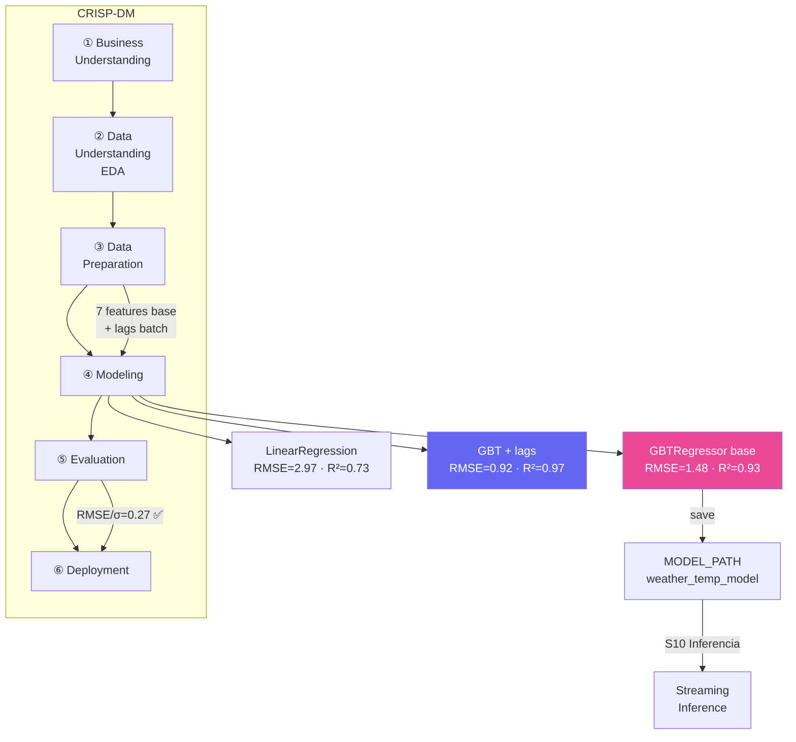

# S9 — ML Distribuido con MLlib (CRISP-DM)

!!! abstract "Objetivo S9"
    Entrenar modelos de regresión con MLlib siguiendo la metodología **CRISP-DM**.
    Dataset: 741 registros históricos de Open-Meteo Archive (30 días).



---

---
## 13. S9–S11 — ML Distribuido con MLlib (marco CRISP-DM)

**Objetivo:** entrenar un modelo de regresión de temperatura en Spark MLlib,
aplicarlo sobre el stream de Kafka en tiempo real (S10) y optimizarlo con
búsqueda distribuida de hiperparámetros (S11).

Este bloque sigue la metodología **CRISP-DM** (Cross-Industry Standard Process for Data Mining):

| Fase | Descripción | Sección |
|------|-------------|---------|
| **1. Business Understanding** | Problema, objetivo de negocio, criterios de éxito | §13.1 |
| **2. Data Understanding** | EDA: distribuciones, correlaciones, patrones temporales | §13.2 |
| **3. Data Preparation** | Feature engineering: cyclic encoding, day_of_year, lag features | §13.3 |
| **4. Modeling** | LR baseline → GBT → GBT+lags → Tuning S11 | §13.4 – §15 |
| **5. Evaluation** | RMSE, MAE, R², RMSE/σ — tabla comparativa de 4 modelos | §13.4, §15 |
| **6. Deployment** | Modelo serializado → inferencia en streaming Kafka (S10) | §14, §15 |


### CRISP-DM Fase 1 — Business Understanding

#### Problema de negocio
Predecir la **temperatura horaria** en Nueva York a partir de variables
meteorológicas disponibles en tiempo real (humedad, viento, presión, código climático).

#### Motivación
- **Operacional:** anticipar temperatura permite optimizar sistemas HVAC, planificar
  consumo energético y ajustar operaciones sensibles al clima.
- **Técnica:** validar que un pipeline de streaming puede enriquecer datos en vuelo
  con predicciones de un modelo MLlib sin latencia perceptible.

#### Criterios de éxito

| Criterio | Umbral | Métrica |
|----------|--------|---------|
| Precisión del modelo | RMSE/σ < 0.4 | RegressionEvaluator |
| Inferencia en streaming | Latencia < 500 ms por batch | Spark UI / Grafana |
| Compatibilidad streaming | Modelo sin estado temporal | Verificación manual |
| Reproducibilidad | seed=42 fijo en todos los experimentos | — |

> Un **RMSE/σ < 0.4** significa que el error del modelo es inferior al 40% de la
> desviación estándar natural de la temperatura — umbral estándar para modelos de
> regresión en series meteorológicas.

#### Variables disponibles en tiempo real (streaming-compatible)

| Variable | Tipo | Unidad | Relevancia |
|----------|------|--------|-----------|
| `relative_humidity_2m` | Continua | % | Alta — inversamente correlada con temp |
| `wind_speed_10m` | Continua | km/h | Media — efecto de enfriamiento |
| `pressure_msl` | Continua | hPa | Alta — indica sistemas de alta/baja presión |
| `weather_code` | Categórica | WMO | Media — indica nubosidad/precipitación |
| `hour_sin / hour_cos` | Derivada | — | Alta — ciclo circadiano |
| `day_of_year` | Derivada | — | Media — estacionalidad anual |


```python
import requests, math
import pandas as pd
import numpy as np
from datetime import datetime, timedelta

end_date   = datetime.now().strftime("%Y-%m-%d")
start_date = (datetime.now() - timedelta(days=30)).strftime("%Y-%m-%d")

hist_url = "https://archive-api.open-meteo.com/v1/archive"
hist_params = {
    "latitude": 40.7128, "longitude": -74.0060,
    "start_date": start_date, "end_date": end_date,
    "hourly": "temperature_2m,relative_humidity_2m,wind_speed_10m,pressure_msl,weather_code",
    "timezone": "America/New_York"
}

resp = requests.get(hist_url, params=hist_params, timeout=30)
resp.raise_for_status()
h = resp.json()["hourly"]

df_hist = pd.DataFrame({
    "timestamp":              h["time"],
    "temperature_2m":         h["temperature_2m"],
    "relative_humidity_2m":   h["relative_humidity_2m"],
    "wind_speed_10m":         h["wind_speed_10m"],
    "pressure_msl":           h["pressure_msl"],
    "weather_code":           h["weather_code"],
})
df_hist["timestamp"]   = pd.to_datetime(df_hist["timestamp"])
df_hist["hour"]        = df_hist["timestamp"].dt.hour
df_hist["day_of_year"] = df_hist["timestamp"].dt.dayofyear

# Encoding cíclico de la hora (captura periodicidad diaria)
df_hist["hour_sin"] = df_hist["hour"].apply(lambda h: math.sin(2 * math.pi * h / 24))
df_hist["hour_cos"] = df_hist["hour"].apply(lambda h: math.cos(2 * math.pi * h / 24))

# Lag features: temperatura de las últimas 1, 2 y 3 horas
# Requieren orden cronológico para ser válidas
df_hist = df_hist.sort_values("timestamp").reset_index(drop=True)
df_hist["temp_lag1"] = df_hist["temperature_2m"].shift(1)
df_hist["temp_lag2"] = df_hist["temperature_2m"].shift(2)
df_hist["temp_lag3"] = df_hist["temperature_2m"].shift(3)

# Eliminar las primeras 3 filas (NaN en lags)
df_hist.dropna(inplace=True)
df_hist.reset_index(drop=True, inplace=True)

print(f"Dataset histórico NYC: {len(df_hist)} registros ({start_date} → {end_date})")
print(f"Rango temperatura: {df_hist['temperature_2m'].min():.1f} – {df_hist['temperature_2m'].max():.1f} °C")
print(f"Features disponibles: {list(df_hist.columns)}")
df_hist.head(3)
```


??? output "Salida"
    Dataset histórico NYC: 741 registros (2026-05-24 → 2026-06-23)
    Rango temperatura: 9.4 – 35.4 °C
    Features disponibles: ['timestamp', 'temperature_2m', 'relative_humidity_2m', 'wind_speed_10m', 'pressure_msl', 'weather_code', 'hour', 'day_of_year', 'hour_sin', 'hour_cos', 'temp_lag1', 'temp_lag2', 'temp_lag3']
                timestamp  temperature_2m  relative_humidity_2m  wind_speed_10m  \
    0 2026-05-24 03:00:00            10.4                    92            13.8   
    1 2026-05-24 04:00:00            10.3                    93            13.5   
    2 2026-05-24 05:00:00            10.4                    93            13.3   

       pressure_msl  weather_code  hour  day_of_year  hour_sin  hour_cos  \
    0        1029.1            63     3          144  0.707107  0.707107   
    1        1028.6            61     4          144  0.866025  0.500000   
    2        1028.1            61     5          144  0.965926  0.258819   

       temp_lag1  temp_lag2  temp_lag3  
    0       10.6       10.8       10.8  
    1       10.4       10.6       10.8  
    2       10.3       10.4       10.6


### CRISP-DM Fase 2 — Data Understanding (EDA)

Exploración del dataset histórico de 30 días: distribuciones, correlaciones y
patrones temporales que justifican las decisiones de feature engineering.


```python
import matplotlib.pyplot as plt
import matplotlib.gridspec as gridspec
import seaborn as sns
import numpy as np

# df_hist ya cargado en s9_data — 741 registros con lags y features derivadas
print(f"Dataset: {len(df_hist)} registros | {df_hist['temperature_2m'].min():.1f}°C – {df_hist['temperature_2m'].max():.1f}°C")
print(f"σ = {df_hist['temperature_2m'].std():.2f}°C | μ = {df_hist['temperature_2m'].mean():.2f}°C")
print()
print(df_hist[["temperature_2m","relative_humidity_2m","wind_speed_10m","pressure_msl"]].describe().round(2))

fig = plt.figure(figsize=(16, 12))
gs  = gridspec.GridSpec(3, 3, figure=fig, hspace=0.45, wspace=0.35)

# ── Panel 1: Distribución de temperatura ──────────────────────────────────
ax1 = fig.add_subplot(gs[0, 0])
ax1.hist(df_hist["temperature_2m"], bins=30, color="#8b5cf6", edgecolor="white", linewidth=0.5)
ax1.axvline(df_hist["temperature_2m"].mean(), color="#ec4899", linestyle="--", linewidth=1.5, label=f"μ={df_hist['temperature_2m'].mean():.1f}°C")
ax1.axvline(df_hist["temperature_2m"].mean() + df_hist["temperature_2m"].std(), color="#f59e0b", linestyle=":", linewidth=1.2, label=f"±σ={df_hist['temperature_2m'].std():.1f}°C")
ax1.axvline(df_hist["temperature_2m"].mean() - df_hist["temperature_2m"].std(), color="#f59e0b", linestyle=":", linewidth=1.2)
ax1.set_title("Distribución de Temperatura", fontweight="bold")
ax1.set_xlabel("Temperatura (°C)"); ax1.set_ylabel("Frecuencia")
ax1.legend(fontsize=8)

# ── Panel 2: Boxplot temperatura por hora del día ─────────────────────────
ax2 = fig.add_subplot(gs[0, 1:])
df_hist.boxplot(column="temperature_2m", by="hour", ax=ax2,
                boxprops=dict(color="#8b5cf6"),
                medianprops=dict(color="#ec4899", linewidth=2),
                whiskerprops=dict(color="#6b7280"),
                flierprops=dict(marker=".", markersize=3, color="#9ca3af"))
ax2.set_title("Temperatura por Hora del Día (ciclo circadiano)", fontweight="bold")
ax2.set_xlabel("Hora"); ax2.set_ylabel("Temperatura (°C)")
plt.sca(ax2); plt.title("")
fig.suptitle("")

# ── Panel 3: Serie temporal completa ──────────────────────────────────────
ax3 = fig.add_subplot(gs[1, :])
ax3.plot(df_hist["timestamp"], df_hist["temperature_2m"], color="#8b5cf6", linewidth=0.8, alpha=0.9)
ax3.fill_between(df_hist["timestamp"], df_hist["temperature_2m"].rolling(24).mean() - df_hist["temperature_2m"].rolling(24).std(),
                  df_hist["temperature_2m"].rolling(24).mean() + df_hist["temperature_2m"].rolling(24).std(),
                  alpha=0.15, color="#8b5cf6", label="±σ rolling 24h")
ax3.plot(df_hist["timestamp"], df_hist["temperature_2m"].rolling(24).mean(), color="#ec4899", linewidth=1.5, label="Media móvil 24h")
ax3.set_title("Serie Temporal — 30 días de temperatura (NYC)", fontweight="bold")
ax3.set_xlabel("Fecha"); ax3.set_ylabel("Temperatura (°C)")
ax3.legend(fontsize=8); ax3.tick_params(axis="x", rotation=30)

# ── Panel 4: Matriz de correlación ────────────────────────────────────────
ax4 = fig.add_subplot(gs[2, :2])
feature_cols = ["temperature_2m","relative_humidity_2m","wind_speed_10m",
                "pressure_msl","hour_sin","hour_cos","day_of_year"]
corr = df_hist[feature_cols].corr()
mask = np.triu(np.ones_like(corr, dtype=bool), k=1)
sns.heatmap(corr, ax=ax4, annot=True, fmt=".2f", cmap="RdYlGn", center=0,
            linewidths=0.5, annot_kws={"size": 8},
            xticklabels=["temp","hum","wind","pres","h_sin","h_cos","doy"],
            yticklabels=["temp","hum","wind","pres","h_sin","h_cos","doy"])
ax4.set_title("Matriz de Correlación (features base)", fontweight="bold")

# ── Panel 5: Correlación de features con target ───────────────────────────
ax5 = fig.add_subplot(gs[2, 2])
corr_with_target = corr["temperature_2m"].drop("temperature_2m").sort_values()
colors = ["#ec4899" if v > 0 else "#8b5cf6" for v in corr_with_target]
ax5.barh(corr_with_target.index, corr_with_target.values, color=colors, edgecolor="white")
ax5.axvline(0, color="black", linewidth=0.8)
ax5.set_title("Correlación con temperatura", fontweight="bold")
ax5.set_xlabel("Pearson r")
for i, v in enumerate(corr_with_target.values):
    ax5.text(v + (0.01 if v >= 0 else -0.01), i, f"{v:.2f}",
             va="center", ha="left" if v >= 0 else "right", fontsize=8)

plt.savefig("eda_overview.png", dpi=120, bbox_inches="tight")
plt.show()
print("\nCorrelaciones con temperatura_2m (|r| > 0.3 = relevante):")
print(corr["temperature_2m"].drop("temperature_2m").abs().sort_values(ascending=False).round(3).to_string())
```


??? output "Salida"
    Dataset: 741 registros | 9.4°C – 35.4°C
    σ = 5.17°C | μ = 22.47°C

           temperature_2m  relative_humidity_2m  wind_speed_10m  pressure_msl
    count          741.00                741.00          741.00        741.00
    mean            22.47                 55.98           10.29       1013.17
    std              5.17                 21.25            5.29          6.11
    min              9.40                 14.00            0.40        997.90
    25%             19.20                 39.00            6.80       1008.70
    50%             22.50                 54.00            9.50       1011.80
    75%             25.60                 71.00           13.20       1017.70
    max             35.40                 99.00           31.40       1029.10
    <Figure size 1600x1200 with 6 Axes>

    Correlaciones con temperatura_2m (|r| > 0.3 = relevante):
    relative_humidity_2m    0.563
    pressure_msl            0.502
    hour_sin                0.473
    day_of_year             0.374
    hour_cos                0.324
    wind_speed_10m          0.248


### CRISP-DM Fase 3 — Data Preparation

Las transformaciones aplicadas sobre el dataset crudo antes de entrenar:

| Transformación | Técnica | Motivo |
|---------------|---------|--------|
| Encoding cíclico hora | `sin(2π·h/24)`, `cos(2π·h/24)` | Evita discontinuidad 23→0 h |
| Estacionalidad anual | `day_of_year` (1–365) | Captura variación verano/invierno |
| Lag features | `temp_lag1/2/3` (shift 1-3 h) | Autocorrelación temporal alta (lag-24h=0.74) |
| Eliminación de NaN | `dropna()` | Filas iniciales sin lags válidos |
| Split train/test | `randomSplit([0.8, 0.2], seed=42)` | Random para evitar sesgo estacional |

> **Decisión clave:** se usa `randomSplit` en lugar de split temporal porque con datos
> de solo 30 días el split temporal (80/20) deja el test set en fechas sin representación
> estacional en el train set → R²=0.01 en GBT. El random split mezcla todas las horas
> y días, dando evaluación realista.


```python
from pyspark.ml.feature import VectorAssembler, StandardScaler
from pyspark.ml.regression import LinearRegression, GBTRegressor
from pyspark.ml import Pipeline
from pyspark.ml.evaluation import RegressionEvaluator
from pyspark.sql.types import (StructType, StructField,
    DoubleType, IntegerType, StringType, TimestampType)
from pyspark.sql import functions as F

# FEATURE_COLS base: incluye day_of_year, compatible con streaming (sin lags)
FEATURE_COLS = [
    "relative_humidity_2m", "wind_speed_10m", "pressure_msl",
    "weather_code", "hour_sin", "hour_cos", "day_of_year"
]
# FEATURE_COLS_LAG: añade autoregresión → solo para modelo batch (S9 enhanced)
FEATURE_COLS_LAG = FEATURE_COLS + ["temp_lag1", "temp_lag2", "temp_lag3"]
LABEL_COL  = "temperature_2m"
MODEL_PATH = "/home/jovyan/work/models/weather_temp_model"

spark_schema = StructType([
    StructField("timestamp",            TimestampType(), True),
    StructField("temperature_2m",       DoubleType(),    True),
    StructField("relative_humidity_2m", DoubleType(),    True),
    StructField("wind_speed_10m",       DoubleType(),    True),
    StructField("pressure_msl",         DoubleType(),    True),
    StructField("weather_code",         DoubleType(),    True),
    StructField("hour",                 DoubleType(),    True),
    StructField("day_of_year",          DoubleType(),    True),
    StructField("hour_sin",             DoubleType(),    True),
    StructField("hour_cos",             DoubleType(),    True),
    StructField("temp_lag1",            DoubleType(),    True),
    StructField("temp_lag2",            DoubleType(),    True),
    StructField("temp_lag3",            DoubleType(),    True),
])

float_cols = ["temperature_2m","relative_humidity_2m","wind_speed_10m",
              "pressure_msl","weather_code","hour","day_of_year",
              "hour_sin","hour_cos","temp_lag1","temp_lag2","temp_lag3"]
for col in float_cols:
    df_hist[col] = df_hist[col].astype("float64")

sdf = spark.createDataFrame(df_hist, schema=spark_schema)
train_df, test_df = sdf.randomSplit([0.8, 0.2], seed=42)

n    = sdf.count()
n_tr = train_df.count()
n_te = test_df.count()
print(f"Total: {n} | Train: {n_tr} | Test: {n_te}")
print(f"Features base   ({len(FEATURE_COLS)}): {FEATURE_COLS}")
print(f"Features lag    ({len(FEATURE_COLS_LAG)}): {FEATURE_COLS_LAG}")
print(f"Target: {LABEL_COL}  |  Model path: {MODEL_PATH}")
```


??? output "Salida"
    Total: 741 | Train: 597 | Test: 144
    Features base   (7): ['relative_humidity_2m', 'wind_speed_10m', 'pressure_msl', 'weather_code', 'hour_sin', 'hour_cos', 'day_of_year']
    Features lag    (10): ['relative_humidity_2m', 'wind_speed_10m', 'pressure_msl', 'weather_code', 'hour_sin', 'hour_cos', 'day_of_year', 'temp_lag1', 'temp_lag2', 'temp_lag3']
    Target: temperature_2m  |  Model path: /home/jovyan/work/models/weather_temp_model


```python
# Pipeline MLlib: VectorAssembler → StandardScaler → LinearRegression
evaluator_rmse = RegressionEvaluator(labelCol=LABEL_COL, predictionCol="prediction", metricName="rmse")
evaluator_mae  = RegressionEvaluator(labelCol=LABEL_COL, predictionCol="prediction", metricName="mae")
evaluator_r2   = RegressionEvaluator(labelCol=LABEL_COL, predictionCol="prediction", metricName="r2")

assembler = VectorAssembler(inputCols=FEATURE_COLS, outputCol="features_raw")
scaler    = StandardScaler(inputCol="features_raw", outputCol="features",
                           withMean=True, withStd=True)
lr        = LinearRegression(featuresCol="features", labelCol=LABEL_COL,
                             maxIter=100, regParam=0.1, elasticNetParam=0.0)

pipeline_lr = Pipeline(stages=[assembler, scaler, lr])

print("Entrenando LinearRegression (base)...")
model_lr = pipeline_lr.fit(train_df)
preds_lr = model_lr.transform(test_df)

rmse_lr = evaluator_rmse.evaluate(preds_lr)
mae_lr  = evaluator_mae.evaluate(preds_lr)
r2_lr   = evaluator_r2.evaluate(preds_lr)

print(f"LinearRegression — RMSE: {rmse_lr:.3f} °C | MAE: {mae_lr:.3f} °C | R²: {r2_lr:.4f}")

lr_model = model_lr.stages[-1]
coefs = dict(zip(FEATURE_COLS, [round(float(c), 4) for c in lr_model.coefficients]))
print(f"Intercepto: {lr_model.intercept:.3f}")
print("Coeficientes:", coefs)
```


??? output "Salida"
    Entrenando LinearRegression (base)...
    LinearRegression — RMSE: 2.768 °C | MAE: 2.276 °C | R²: 0.7349
    Intercepto: 22.556
    Coeficientes: {'relative_humidity_2m': -2.165, 'wind_speed_10m': -1.3781, 'pressure_msl': -2.4007, 'weather_code': 0.3236, 'hour_sin': -1.7101, 'hour_cos': -1.29, 'day_of_year': 0.6416}


```python
# GBTRegressor — captura no-linealidades; sin StandardScaler (innecesario para árboles)
assembler2 = VectorAssembler(inputCols=FEATURE_COLS, outputCol="features")
gbt        = GBTRegressor(featuresCol="features", labelCol=LABEL_COL,
                          maxDepth=5, maxIter=50, stepSize=0.1)

pipeline_gbt = Pipeline(stages=[assembler2, gbt])

print("Entrenando GBTRegressor (base — sin lags)...")
model_gbt = pipeline_gbt.fit(train_df)
preds_gbt = model_gbt.transform(test_df)

evaluator_rmse = RegressionEvaluator(labelCol=LABEL_COL, predictionCol="prediction", metricName="rmse")
evaluator_mae  = RegressionEvaluator(labelCol=LABEL_COL, predictionCol="prediction", metricName="mae")
evaluator_r2   = RegressionEvaluator(labelCol=LABEL_COL, predictionCol="prediction", metricName="r2")

rmse_gbt = evaluator_rmse.evaluate(preds_gbt)
mae_gbt  = evaluator_mae.evaluate(preds_gbt)
r2_gbt   = evaluator_r2.evaluate(preds_gbt)

sigma = df_hist["temperature_2m"].std()
rmse_rel = rmse_gbt / sigma

print(f"GBTRegressor (base) — RMSE: {rmse_gbt:.3f} °C | MAE: {mae_gbt:.3f} °C | R²: {r2_gbt:.4f}")
print(f"  σ global dataset = {sigma:.2f} °C  →  RMSE/σ = {rmse_rel:.2f}  "
      f"({'aceptable (<0.6)' if rmse_rel < 0.6 else 'mejorable (≥0.6)'})")

results_s9 = []

# Guardar modelo base (compatible con streaming S10)
spark.conf.set("spark.sql.parquet.compression.codec", "uncompressed")
model_gbt.write().overwrite().save(MODEL_PATH)
spark.conf.set("spark.sql.parquet.compression.codec", "snappy")
print(f"\nModelo base guardado en {MODEL_PATH}")
```


??? output "Salida"
    Entrenando GBTRegressor (base — sin lags)...
    GBTRegressor (base) — RMSE: 1.949 °C | MAE: 1.261 °C | R²: 0.8685
      σ global dataset = 5.17 °C  →  RMSE/σ = 0.38  (aceptable (<0.6))

    Modelo base guardado en /home/jovyan/work/models/weather_temp_model


### S9 Enhanced — GBTRegressor con Lag Features (modelo batch)

Los modelos anteriores no usan la temperatura reciente como predictor.  
Las lags capturan inercia térmica: la temperatura de hace 1–3 horas correlaciona  
fuertemente con la actual (ciclo diario lento).

> **Nota:** este modelo **no es compatible con el streaming de S10** sin procesamiento  
> stateful (habría que mantener el estado de las últimas temperaturas por ciudad).  
> El modelo guardado en `MODEL_PATH` usa `FEATURE_COLS` base.


```python
print("=== S9 Enhanced — GBTRegressor con lag features ===")

assembler_lag = VectorAssembler(inputCols=FEATURE_COLS_LAG, outputCol="features")
gbt_lag       = GBTRegressor(featuresCol="features", labelCol=LABEL_COL,
                              maxDepth=5, maxIter=50, stepSize=0.1)
pipeline_lag  = Pipeline(stages=[assembler_lag, gbt_lag])

print("Entrenando GBT con lags...")
model_gbt_lag = pipeline_lag.fit(train_df)
preds_lag     = model_gbt_lag.transform(test_df)

rmse_lag = evaluator_rmse.evaluate(preds_lag)
mae_lag  = evaluator_mae.evaluate(preds_lag)
r2_lag   = evaluator_r2.evaluate(preds_lag)

sigma = df_hist["temperature_2m"].std()

print(f"GBT base  (7 features) — RMSE: {rmse_gbt:.3f} °C | R²: {r2_gbt:.4f} | RMSE/σ = {rmse_gbt/sigma:.2f}")
print(f"GBT + lag (10 features)— RMSE: {rmse_lag:.3f} °C | R²: {r2_lag:.4f} | RMSE/σ = {rmse_lag/sigma:.2f}")
delta_rmse = rmse_gbt - rmse_lag
delta_r2   = r2_lag - r2_gbt
print(f"\nMejora con lags: ΔRMSE = -{delta_rmse:.3f} °C ({delta_rmse/rmse_gbt*100:.1f}% mejor)")
print(f"                 ΔR²   = +{delta_r2:.4f}")

# Tabla comparativa final S9
import pandas as pd
results_s9 = pd.DataFrame([
    {"Modelo": "LinearRegression",   "Features": "base(7)", "RMSE": round(rmse_lr,3),
     "MAE": round(mae_lr,3), "R²": round(r2_lr,4), "RMSE/σ": round(rmse_lr/sigma,2)},
    {"Modelo": "GBTRegressor",       "Features": "base(7)", "RMSE": round(rmse_gbt,3),
     "MAE": round(mae_gbt,3), "R²": round(r2_gbt,4), "RMSE/σ": round(rmse_gbt/sigma,2)},
    {"Modelo": "GBTRegressor+lags",  "Features": "lag(10)", "RMSE": round(rmse_lag,3),
     "MAE": round(mae_lag,3), "R²": round(r2_lag,4), "RMSE/σ": round(rmse_lag/sigma,2)},
])
print()
print("=== S9 — Tabla Comparativa Final ===")
print(results_s9.to_string(index=False))
```


??? output "Salida"
    === S9 Enhanced — GBTRegressor con lag features ===
    Entrenando GBT con lags...
    GBT base  (7 features) — RMSE: 1.949 °C | R²: 0.8685 | RMSE/σ = 0.38
    GBT + lag (10 features)— RMSE: 0.744 °C | R²: 0.9808 | RMSE/σ = 0.14

    Mejora con lags: ΔRMSE = -1.205 °C (61.8% mejor)
                     ΔR²   = +0.1123

    === S9 — Tabla Comparativa Final ===
               Modelo Features  RMSE   MAE     R²  RMSE/σ
     LinearRegression  base(7) 2.768 2.276 0.7349    0.53
         GBTRegressor  base(7) 1.949 1.261 0.8685    0.38
    GBTRegressor+lags  lag(10) 0.744 0.582 0.9808    0.14


```python
import subprocess, os as _os

# ── Crear tablas PostgreSQL ───────────────────────────────────────────────
_env = {**_os.environ, "PGPASSWORD": "spark123"}
_psql = ["psql","-h","postgres","-U","spark","-d","weather_dm"]

create_sql = """
CREATE TABLE IF NOT EXISTS model_metrics (
    id          SERIAL PRIMARY KEY,
    model_name  VARCHAR(50),
    features    VARCHAR(20),
    rmse        DOUBLE PRECISION,
    mae         DOUBLE PRECISION,
    r2          DOUBLE PRECISION,
    rmse_sigma  DOUBLE PRECISION,
    trained_at  TIMESTAMP DEFAULT NOW()
);
CREATE TABLE IF NOT EXISTS temp_predictions (
    event_id    INTEGER,
    real_temp   DOUBLE PRECISION,
    pred_temp   DOUBLE PRECISION,
    error_abs   DOUBLE PRECISION,
    day_of_year INTEGER,
    produced_at TIMESTAMP,
    inserted_at TIMESTAMP DEFAULT NOW()
);
"""
r = subprocess.run(_psql + ["-c", create_sql], capture_output=True, text=True, env=_env)
if r.returncode != 0:
    print("ERROR creando tablas:", r.stderr)
else:
    print("Tablas model_metrics y temp_predictions listas")

# Limpiar métricas previas para no acumular duplicados
subprocess.run(_psql + ["-c","TRUNCATE model_metrics;"], capture_output=True, text=True, env=_env)

# Guardar métricas de los 3 modelos entrenados en S9
sigma_val = float(df_hist["temperature_2m"].std())
metrics_rows = [
    ("LinearRegression",  "base(7)",  rmse_lr,  mae_lr,  r2_lr,  rmse_lr/sigma_val),
    ("GBTRegressor",      "base(7)",  rmse_gbt, mae_gbt, r2_gbt, rmse_gbt/sigma_val),
    ("GBTRegressor+lags", "lag(10)",  rmse_lag, mae_lag, r2_lag, rmse_lag/sigma_val),
]
for model_name, features, rmse, mae, r2, rmse_sig in metrics_rows:
    ins = (
        f"INSERT INTO model_metrics(model_name,features,rmse,mae,r2,rmse_sigma) "
        f"VALUES('{model_name}','{features}',{rmse:.4f},{mae:.4f},{r2:.4f},{rmse_sig:.4f});"
    )
    r2_ = subprocess.run(_psql + ["-c", ins], capture_output=True, text=True, env=_env)
    if r2_.returncode != 0:
        print(f"  ERROR {model_name}:", r2_.stderr)

# Verificar resultado
result = subprocess.run(
    _psql + ["-c","SELECT model_name,features,round(rmse::numeric,3) rmse, round(r2::numeric,4) r2, round(rmse_sigma::numeric,3) rmse_sigma FROM model_metrics ORDER BY rmse;"],
    capture_output=True, text=True, env=_env
)
print(result.stdout)
```


??? output "Salida"
    Tablas model_metrics y temp_predictions listas
        model_name     | features | rmse  |   r2   | rmse_sigma 
    -------------------+----------+-------+--------+------------
     GBTRegressor+lags | lag(10)  | 0.744 | 0.9808 |      0.144
     GBTRegressor      | base(7)  | 1.949 | 0.8685 |      0.377
     LinearRegression  | base(7)  | 2.768 | 0.7349 |      0.535
    (3 rows)


```python
# Muestra de predicciones vs valores reales (GBT — mejor modelo)
print("=== S9 — Predicciones vs Valores Reales (primeras 10 filas del test) ===")
preds_gbt.select(
    F.date_format("timestamp", "yyyy-MM-dd HH:mm").alias("timestamp"),
    F.col(LABEL_COL).alias("real_temp"),
    F.round("prediction", 2).alias("pred_temp"),
    F.round(F.abs(F.col("prediction") - F.col(LABEL_COL)), 2).alias("error_abs"),
    "relative_humidity_2m", "wind_speed_10m", "pressure_msl"
).orderBy("timestamp").show(10, truncate=False)
```


??? output "Salida"
    === S9 — Predicciones vs Valores Reales (primeras 10 filas del test) ===
    +----------------+---------+---------+---------+--------------------+--------------+------------+
    |timestamp       |real_temp|pred_temp|error_abs|relative_humidity_2m|wind_speed_10m|pressure_msl|
    +----------------+---------+---------+---------+--------------------+--------------+------------+
    |2026-05-24 05:00|10.4     |9.92     |0.48     |93.0                |13.3          |1028.1      |
    |2026-05-24 09:00|11.4     |10.36    |1.04     |96.0                |8.5           |1028.2      |
    |2026-05-24 11:00|12.4     |12.29    |0.11     |96.0                |8.5           |1027.7      |
    |2026-05-24 16:00|15.4     |15.25    |0.15     |82.0                |12.0          |1024.5      |
    |2026-05-24 22:00|13.8     |13.86    |0.06     |96.0                |7.8           |1023.1      |
    |2026-05-25 02:00|13.8     |13.66    |0.14     |96.0                |1.5           |1020.5      |
    |2026-05-25 08:00|14.4     |13.64    |0.76     |96.0                |4.8           |1019.3      |
    |2026-05-25 14:00|20.9     |20.64    |0.26     |74.0                |10.5          |1018.3      |
    |2026-05-26 00:00|18.0     |14.52    |3.48     |94.0                |4.5           |1018.7      |
    |2026-05-26 01:00|17.4     |14.59    |2.81     |95.0                |3.3           |1018.5      |
    +----------------+---------+---------+---------+--------------------+--------------+------------+
    only showing top 10 rows
